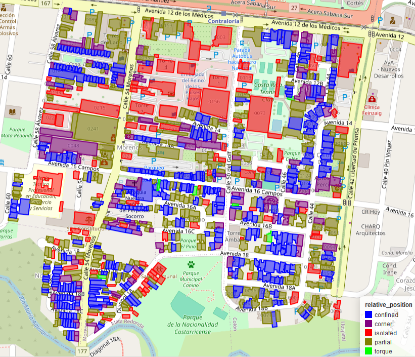
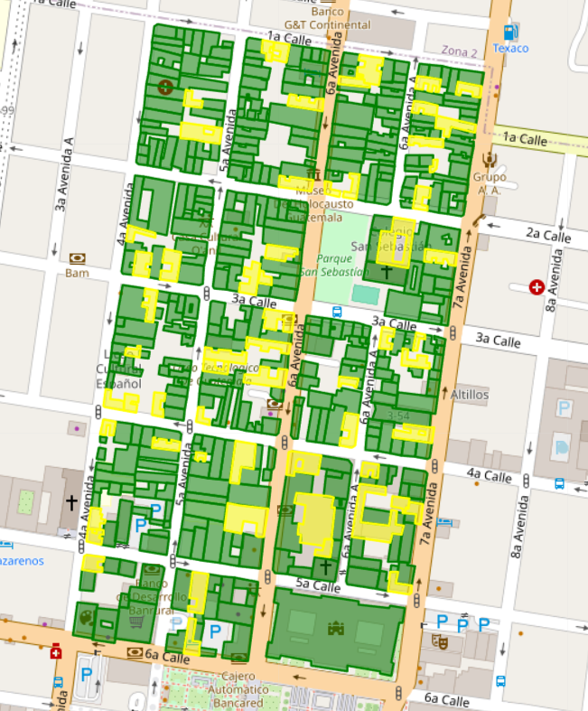
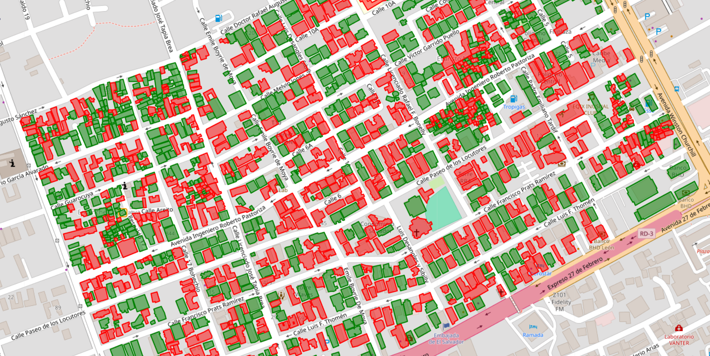

# SeismicBuildingExposure

**SeismicBuildingExposure** es una librería de Python construida sobre GeoPandas para calcular diversos índices geométricos relacionados con la geometría de huellas de edificaciones y riesgo sísmico.

---

## Instalación

Para instalar el paquete, usa el siguiente comando:

```bash
pip install git+https://github.com/GeomaticsCaminosUPM/SeismicBuildingExposure.git
```

---

## Funcionalidades

### 1. **Posición Relativa de los Edificios**
Esta funcionalidad determina si un edificio toca otras estructuras (posición relativa dentro de la manzana). Se calculan “fuerzas” que las estructuras vecinas ejercen sobre el edificio, proporcionales al área de contacto (longitud del contacto entre huellas multiplicada por la altura del edificio) en la dirección normal al plano de contacto.

Las fuerzas de contacto se computan para ayudar a determinar la clase de posición relativa:

- **Aceleración angular (`angular_acc`)**:  
  La aceleración angular, calculada como:

  $$\text{aceleración angular} = \frac{\text{momento} \cdot \text{área}}{\text{inercia}}$$

  Donde el **momento** se calcula como:

  $$\text{momento} = \sum \(\text{distancia} \cdot |\text{fuerza}_i|\)$$

- **Fuerza (`force`)**:  
  Magnitud de la fuerza resultante actuando sobre la huella, normalizada por la raíz cuadrada del área:

  $$\text{fuerza} = \left| \sum \text{fuerza}_i \right|$$

- **Índice de confinamiento (`confinement_ratio`)**:  
  Proporción de fuerzas totales que están confinadas (compensadas por fuerzas opuestas):

  $$\text{índice de confinamiento} = \frac{\sum |\text{fuerza}_i| - \left| \sum \text{fuerza}_i \right|}{\left| \sum \text{fuerza}_i \right|}$$

- **Ángulo (`angle`)**:  
  Suma normalizada de los ángulos entre las fuerzas individuales y la fuerza resultante:

  $$\text{ángulo} = \frac{\sum \left( |\text{fuerza}_i| \cdot \text{ángulo}(\text{fuerza}_i, \sum \text{fuerza}_j) \right)}{\left| \sum \text{fuerza}_i \right|}$$

Clases de posición relativa:
1. **"torque"**: Alta aceleración angular y clase **confinado** o **esquina**.
2. **"confinado"**: Toca ambos lados laterales.
3. **"esquina"**: Toca en una esquina.
4. **"lateral"**: Toca un solo lado.
5. **"aislado"**: No toca otras estructuras.

<div align="center">
  
</div>

---

### 2. **Irregularidad**
Mide la irregularidad geométrica de las **huellas de edificaciones** usando distintos índices normativos.

#### 2.1. Eurocódigo 8

La irregularidad se mide siguiendo el [Eurocódigo 8](https://www.phd.eng.br/wp-content/uploads/2015/02/en.1998.1.2004.pdf).

Parámetros calculados:

- **Relación de excentricidad (`excentricity_ratio`)**:  
  $\text{relación de excentricidad} = \frac{\text{excentricidad}}{\text{radio torsional}}$

- **Relación de radios (`radius_ratio`)**:  
  $\text{relación de radios} = \frac{\text{radio torsional}}{\text{radio de giro}}$

- **Esbeltez (`slenderness`)**:  
  Se usa:  
  $\sqrt{\frac{I_1}{I_2}}$  
  donde $I_1$ e $I_2$ son los valores principales del tensor de inercia.

- **Compacidad (`compactness`)**:  
  $\text{compacidad} = \frac{\text{área del polígono (con huecos rellenados)}}{\text{área del casco convexo}}$

La función `eurocode_8_df` devuelve la **dirección más débil** como un ángulo (en grados) respecto al **norte (en coordenadas UTM)**.

**Definiciones:**

- **Excentricidad**: Distancia entre el centro de masa y el centro de rigidez.
- **Radio torsional**: $\sqrt{\frac{I_t}{I_j}}$
- **Radio de giro**: $\sqrt{\frac{I_0}{\text{área}}}$

**Límites de parámetros:**

| Parámetro               | Límite |
|------------------------|--------|
| Relación de excentricidad | < 0.3  |
| Relación de radios         | < 1.0  |
| Esbeltez                  | < 4.0  |
| Compacidad                | > 0.95 |

#### 2.2. Normativa Código Sísmico de Costa Rica

La irregularidad se mide siguiendo el [Código Sísmico de Costa Rica](https://www.codigosismico.or.cr/).

Parámetro calculado:

- **Relación de excentricidad (`excentricity_ratio`)**:  
  $\text{relación de excentricidad} = \frac{\text{excentricidad}}{\text{dimensión}}$

La función `codigo_sismico_costa_rica_df` devuelve la **dirección más débil** como un ángulo (en grados) respecto al **norte (coordenadas UTM)**.

**Definiciones:**

- **Excentricidad**: Distancia entre el centro de masa y el centro de rigidez.
- **Dimensión (`dimension`)**:  
  $\text{dimensión} = \sqrt{\text{área} \cdot \sqrt{\frac{I_i}{I_j}}}$

**Límites de parámetros:**

| Relación de excentricidad | Nivel de irregularidad |
|---------------------------|-------------------------|
| < 0.05                    | Regular                 |
| 0.05–0.25                 | Moderada                |
| > 0.25                    | Alta                    |

<div align="center">
  
</div>

#### 2.3. Normativa NTC México

La irregularidad se mide siguiendo la normativa NTC de México.

Parámetros calculados:

- **Relación de retranqueo (`setback_ratio`)**:  
  $\text{relación de retranqueo} = \frac{\text{longitud del retranqueo}}{\text{longitud del lado}}$

- **Relación de huecos (`hole_ratio`)**:  
  $\text{relación de huecos} = \frac{\text{ancho del hueco}}{\text{longitud del lado}}$

**Definiciones:**

- **Longitud del lado (`side length`)**: Del rectángulo mínimo alineado a los ejes principales de inercia.
- **Longitud del retranqueo (`setback length`)**: Longitud del rectángulo que circunscribe los polígonos del retranqueo.
- **Ancho del hueco (`hole width`)**: Longitud del lado del rectángulo que circunscribe cada hueco.
- **Máxima esbeltez (`max slenderness`)**: Esbeltez máxima de los retranqueos para filtrar irregularidades no significativas.

**Límites de parámetros:**

| Parámetro               | Límite |
|------------------------|--------|
| Relación de retranqueo | < 0.4  |
| Relación de huecos     | < 0.4  |

<div align="center">
  
</div>

#### 2.4. Índices geométricos

##### **Índice Polsby-Popper**
Mide la compacidad (circularidad):

$$\text{Índice Polsby-Popper} = \frac{4 \pi A}{P^2}$$

##### **Índice de momento del casco convexo**
Mide la irregularidad comparando la huella con su casco convexo:

$$\text{Momento del casco convexo} = \frac{l \cdot d}{L}$$

##### **Irregularidad por círculo de inercia**
Compara la inercia de un polígono con la de un círculo equivalente:

$$\text{Irregularidad de inercia} = \frac{\text{Inercia del círculo equivalente}}{\text{Inercia del polígono}}$$

##### **Esbeltez por inercia (`inertia_slenderness`)**
$$\text{Esbeltez por inercia} = \sqrt{\frac{I_1}{I_2}}$$

##### **Esbeltez circunscrita (`circunscribed_slenderness`)**
$$\text{Esbeltez circunscrita} = \frac{L_1}{L_2}$$

##### **Eurocódigo 8**
Índices disponibles como funciones independientes:
- Excentricidad EC8
- Relación de radios
- Esbeltez
- Compacidad

##### **Código Sísmico de Costa Rica**
- Excentricidad CR

##### **Norma NTC México**
- Relación de retranqueo
- Relación de huecos

---

### 3. Alturas

En desarrollo.

---
