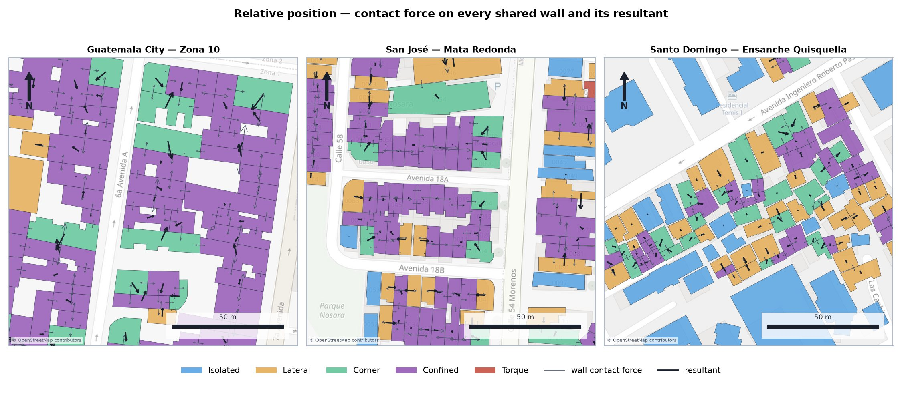
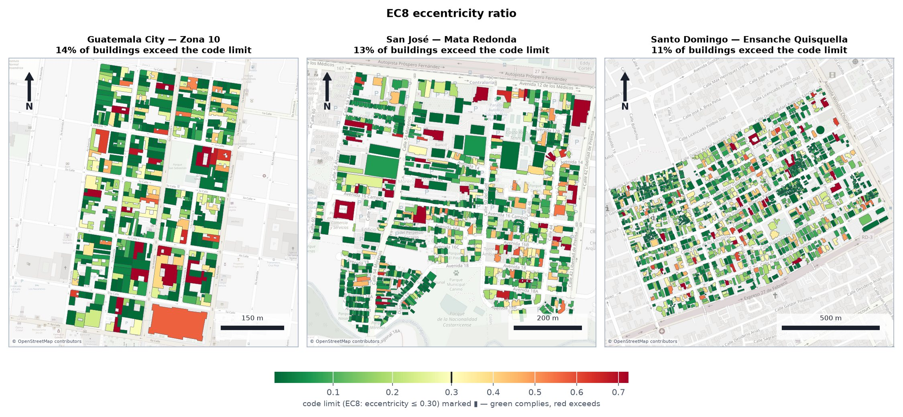
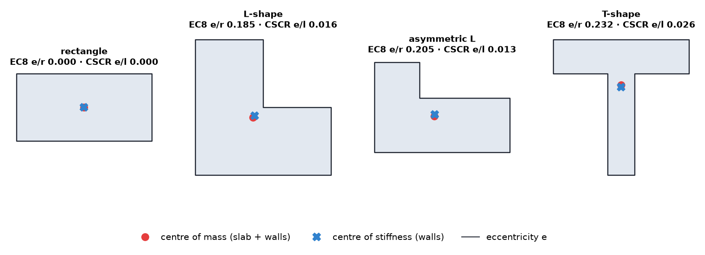
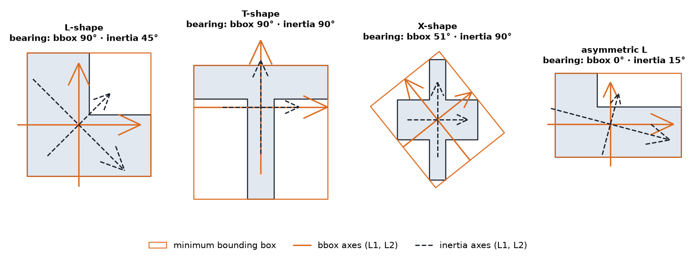
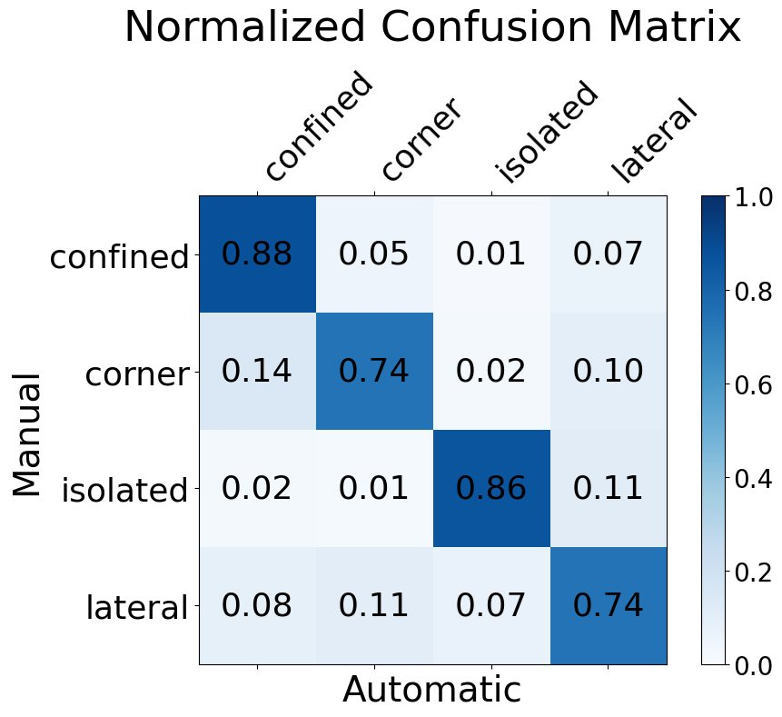

<h1 align="center">footprint_attributes</h1>

<p align="center">
  <strong>Seismic behaviour modifiers from 2-D building footprints — automated, objective, reproducible.</strong>
</p>

<p align="center">
  <a href="https://github.com/GeomaticsCaminosUPM/footprint_attributes/actions/workflows/tests.yml"></a>
  <a href="https://footprint-attributes.readthedocs.io/en/latest/"></a>
  <a href="https://doi.org/10.1186/s40323-026-00323-y"></a>
  
  <a href="LICENSE"></a>
</p>

<p align="center">
  <a href="https://footprint-attributes.readthedocs.io/en/latest/">Documentation</a> ·
  <a href="https://footprint-attributes.readthedocs.io/en/latest/concepts.html">Concepts</a> ·
  <a href="https://footprint-attributes.readthedocs.io/en/latest/formulas.html">Formulas</a> ·
  <a href="https://footprint-attributes.readthedocs.io/en/latest/examples.html#interactive-map">Interactive map</a> ·
  <a href="#citation">Citation</a>
</p>

<p align="center">
  
</p>

`footprint_attributes` turns a file of building footprint polygons into the attributes seismic risk models need for every building: its **direction**, its **position within the urban block**, and its **plan-shape irregularity** under five international seismic codes. Each is computed with a deterministic geometric algorithm, not expert judgement. It implements the methodology of:

> Ureña-Pliego, M., Rodríguez-Saiz, J., Núñez-Álvarez, G., Marchamalo-Sacristán, M., González-Rodrigo, B. (2026).
> *A methodology for the automated estimation of footprint-derived seismic behaviour modifiers in building exposure assessment.*
> Advanced Modeling and Simulation in Engineering Sciences, 13:3. [doi.org/10.1186/s40323-026-00323-y](https://link.springer.com/content/pdf/10.1186/s40323-026-00323-y.pdf)

Developed by the [Advanced Geomatics group (AGA)](https://blogs.upm.es/aga/en/) at the Universidad Politécnica de Madrid.

> **Footprint digitalisation** (Mask2Former / SAM2 instance segmentation) is out of scope; this package starts from an already-digitised footprint file.

---

## Contents

- [Why this package?](#why-this-package)
- [What is computed?](#what-is-computed)
- [Installation](#installation)
- [Quick start](#quick-start)
- [Interactive map](#interactive-map)
- [Validation](#validation)
- [Repository layout](#repository-layout)
- [Documentation](#documentation)
- [Citation](#citation)
- [License](#license)

---

## Why this package?

Seismic risk models adjust each structural typology's vulnerability with *behaviour modifiers*. Several of them can be derived from the 2-D footprint alone, but they are usually assigned by hand by surveyors reading code provisions. This package turns those provisions into geometric algorithms, so the same footprint always gets the same answer and a national inventory takes minutes, not field campaigns.

<p align="center">
  
</p>

<p align="center">
  
  <br>
  <em>GEM building-taxonomy attributes. The red boxes (direction, position, plan shape and structural irregularity) are automated by this package.</em>
</p>

---

## What is computed?

Every map and chart below was computed by this package from nothing but the raw footprint geometry of three pilot regions: Guatemala City (Zona 10), San José (Mata Redonda) and Santo Domingo (Ensanche Quisquella). They are all generated by [`docs/docs_maps_and_plots.py`](docs/docs_maps_and_plots.py).

### 1 · Block position within the block — `position`

A building's neighbours change how it behaves in an earthquake: an isolated building sways freely, a confined one is restrained but may pound against its neighbours, and one touched unevenly can twist. A **contact-force analogy** applies a virtual unit pressure to every shared wall; the size of the resultant, how much it cancels out and how much it would twist the building decide the class.

| Class | Meaning |
|---|---|
| **isolated** | No touching neighbours |
| **lateral** | Pushed from one side |
| **corner** | Pushed from two non-opposite sides |
| **confined** | Pushed from opposite sides that largely cancel |
| **torque** | Corner or confined, but unevenly enough to twist |

<p align="center">
  
  <br><em>One hand-built scenario per class: thin arrows are the push on each shared wall, the thick arrow their resultant.</em>
</p>

<p align="center">
  
  <br><em>The same construction on real buildings in each pilot region.</em>
</p>

### 2 · Footprint shape indices — `shape`

Plan-irregularity parameters from **five international seismic codes**, plus three code-independent compactness indices (`polsby_popper`, `convex_hull_irregularity`, `inertia_circle_ratio`). Every code parameter also gets a `compliance_{NORM}_{param}` column (a 0–100 score against the code's own limit).

| Code | `shape.<NORM>` | Parameters |
|---|---|---|
| **Eurocode 8** (EN 1998-1) | `EC8` | eccentricity ratio, radius ratio, compactness |
| **Costa Rica CSCR 2010** | `CSCR2010` | eccentricity ratio |
| **Italian GNDT Level II** | `GNDTII` | β₁ (main-shape slenderness), β₂ (setback ratio), β₄ (eccentricity ratio), β₆ (setback slenderness) |
| **US ASCE 7** | `ASCE7` | setback ratio, hole ratio, parallelity angle |
| **Mexican NTC-23** | `NTC23` | setback ratio, hole ratio |

Plan slenderness (`shape.slenderness`) applies across codes.

<p align="center">
  
  <br><em>The shape index condenses three code checks: EC8 eccentricity > 0.3, ASCE 7 setback > 0.2, slenderness > 4.</em>
</p>

<p align="center">
  
  <br><em>Each of the 15 code metrics is mapped against its own limit (green complies, red exceeds). The <a href="https://footprint-attributes.readthedocs.io/en/latest/formulas.html">Formulas page</a> has all of them.</em>
</p>

All shape indices use a *hollow-box* model: uniform walls and one slab. The offset between the centre of mass and the centre of stiffness is the eccentricity that makes a building twist:

<p align="center">
  
</p>
<p align="center">
  
</p>

<p align="center">
  
  <br><em>How often each code limit is exceeded, per pilot region.</em>
</p>

### 3 · Building direction — `direction`

The orientation of the footprint's principal axes, by two independent methods:

- `direction.bbox` — axes of the minimum rotated bounding box.
- `direction.inertia` — principal axes of the second moment of area (exact closed form). The *weak* axis defines the building's `bearing`.

<p align="center">
  
</p>
<p align="center">
  
  <br><em>Bearing (inertia) on a cyclic colour ramp: each street grid shows up clearly.</em>
</p>

### 4 · Basic plan dimensions

Setback and slenderness parameters are built from a few lengths read off each footprint. These are its overall dimensions `L1`/`L2`, the main rectangular element `a1`/`a2` (found with the largest inscribed circle), and the largest setback `b`/`c` (from `convex_hull − footprint`):

<p align="center">
  &nbsp;&nbsp;&nbsp;
</p>
<p align="center">
  
</p>
<p align="center">
  
</p>

---

## Installation

Pinned to the [v1.0.0 release](https://github.com/GeomaticsCaminosUPM/footprint_attributes/releases/tag/v1.0.0):

```bash
pip install "footprint-attributes @ git+https://github.com/GeomaticsCaminosUPM/footprint_attributes.git@v1.0.0"
```

Dependencies: `geopandas`, `shapely>=2.0`, `numpy`, `pandas`, `scipy`, `scikit-learn`, `statsmodels`, `tabulate`.

The `visualization` extra (`pip install "footprint-attributes[visualization]"`) adds what `footprint_attributes.visualization` needs for the [interactive map](#interactive-map) and the example notebooks' maps.

---

## Quick start

```python
import geopandas as gpd
from footprint_attributes import direction, shape, position
import footprint_attributes

footprints = gpd.read_file("footprints.gpkg")

# ── Building direction ─────────────────────────────────────────────────────
footprints["bearing"] = direction.inertia(footprints)

# ── Block position within the block ─────────────────────────────────────
footprints = position(footprints, buffer=0.1, height_column="height")

# ── Eurocode 8 shape indices ────────────────────────────────────────────────
ec8 = shape.EC8(footprints)
footprints["EC8_compactness"] = ec8["EC8_compactness"]
footprints["EC8_eccentricityRatio"] = ec8["EC8_eccentricityRatio"]

# ── Or a single entry point: request any mix of columns in one call ────────
result = footprint_attributes.run(
    footprints,
    config={"columns": ["EC8", "position", "bearing"]},
)

footprints.to_file("results.gpkg")
```

The [`examples/`](examples/) notebooks walk through every module on the real pilot-region data; each opens in Colab.

---

## Interactive map

`footprint_attributes.visualization.build_map` builds a self-contained MapLibre + deck.gl 3D map. It shows one dataset per region, coloured by block position, the shape index or any of the 15 shape metrics. It has an auto-playing tour and overlays for the convex hull, bounding box, inertia axis, basic lengths and contact-force arrows. Try it live [in the docs](https://footprint-attributes.readthedocs.io/en/latest/examples.html#interactive-map).

```python
import geopandas as gpd
from footprint_attributes.visualization import build_map

datasets = {"guatemala": gpd.read_file("guatemala_pilot_region.gpkg")}
build_map(datasets, "output/map")
# then: python -m http.server --directory output/map
```

<p align="center">
  &nbsp;&nbsp;
  
</p>

---

## Validation

The methodology was validated against hand-labelled building inventories from the three pilot areas. The automated shape and position classifications were comparable in accuracy to the variability between independent human surveyors.

<p align="center">
  &nbsp;&nbsp;
  
</p>
<p align="center"><em>Left: relative-position confusion matrix. Right: accuracy vs. contact buffer, peaking near the 0.1 m default.</em></p>

---

## Repository layout

```
footprint_attributes/
├── src/footprint_attributes/
│   ├── __init__.py          # public entry points: direction, shape, position, run
│   ├── direction.py         # building orientation (bbox / inertia methods)
│   ├── shape.py             # seismic-code shape indices (EC8, ASCE7, GNDTII, CSCR2010, NTC23)
│   ├── position.py          # contact forces + relative-position classification
│   ├── eccentricity.py      # Mohr's-circle worst-case eccentricity optimisation
│   ├── geometry.py          # shared low-level geometry primitives
│   ├── config.py            # code limits, compliance grades, default thresholds
│   ├── runner.py            # `run()` single entry point
│   └── visualization/       # interactive 3D map (`visualization` extra)
├── examples/
│   ├── direction.ipynb, position.ipynb, shape.ipynb, building_sizes.ipynb, run.ipynb
│   └── data/                # sample footprints, one file per pilot area
├── docs/                    # Sphinx documentation
│   ├── docs_maps_and_plots.py   # regenerates every map and plot below
│   ├── figures/             # plots and paper figures used by the docs and this README
│   └── maps/                # static pilot-region maps
├── tests/                   # pytest suite
└── figures/                 # paper sources (LaTeX, BibTeX, per-city paper figures)
```

---

## Documentation

Full docs at **[footprint-attributes.readthedocs.io](https://footprint-attributes.readthedocs.io/en/latest/)**: a visual [concepts](https://footprint-attributes.readthedocs.io/en/latest/concepts.html) walkthrough, the [formula, source code and pilot-region map](https://footprint-attributes.readthedocs.io/en/latest/formulas.html) behind every column, the API reference and the rendered notebooks. To build them locally:

```bash
uv sync --all-groups
uv run python docs/docs_maps_and_plots.py   # regenerate maps and plots (optional)
uv run sphinx-build -b html docs docs/_build/html
```

---

## Citation

If you use this package in research, please cite the paper:

> Ureña-Pliego, M., Rodríguez-Saiz, J., Núñez-Álvarez, G., Marchamalo-Sacristán, M., González-Rodrigo, B. (2026).
> A methodology for the automated estimation of footprint-derived seismic behaviour modifiers in building exposure assessment.
> *Advanced Modeling and Simulation in Engineering Sciences*, 13:3.
> https://doi.org/10.1186/s40323-026-00323-y — [PDF](https://link.springer.com/content/pdf/10.1186/s40323-026-00323-y.pdf)

```bibtex
@article{urena-pliego2026footprint,
  author  = {Ure{\~n}a-Pliego, Miguel and Rodr{\'i}guez-Saiz, Javier and N{\'u}{\~n}ez-{\'A}lvarez, Gonzalo
             and Marchamalo-Sacrist{\'a}n, Miguel and Gonz{\'a}lez-Rodrigo, Beatriz},
  title   = {A methodology for the automated estimation of footprint-derived seismic behaviour
             modifiers in building exposure assessment},
  journal = {Advanced Modeling and Simulation in Engineering Sciences},
  year    = {2026},
  volume  = {13},
  number  = {3},
  doi     = {10.1186/s40323-026-00323-y},
  url     = {https://doi.org/10.1186/s40323-026-00323-y}
}
```

### Authors

| Author | ORCID | Affiliation |
|---|---|---|
| Miguel Ureña-Pliego | [0000-0001-6594-2566](https://orcid.org/0000-0001-6594-2566) | Dept. of Land Morphology and Engineering, ETSI Caminos, Canales y Puertos, UPM |
| Javier Rodríguez-Saiz | [0009-0004-1054-8608](https://orcid.org/0009-0004-1054-8608) | Dept. of Land Morphology and Engineering, ETSI Caminos, Canales y Puertos, UPM; Buin Ingenieros SL |
| Gonzalo Núñez-Álvarez | [0009-0000-1912-0465](https://orcid.org/0009-0000-1912-0465) | Dept. of Building Structures and Physics, ETSI Arquitectura, UPM |
| Miguel Marchamalo-Sacristán | [0000-0001-9237-4146](https://orcid.org/0000-0001-9237-4146) | Dept. of Land Morphology and Engineering, ETSI Caminos, Canales y Puertos, UPM |
| Beatriz González-Rodrigo | [0000-0003-1038-7459](https://orcid.org/0000-0003-1038-7459) | Dept. of Forestry and Environmental Engineering and Management, ETSI Montes, Forestal y del Medio Natural, UPM |

Developed within the **[Advanced Geomatics group (AGA)](https://blogs.upm.es/aga/en/)**, Universidad Politécnica de Madrid.

### Funding

This research was supported by the Industrial Doctorates of the Community of Madrid (grant number IND2023/TIC-28743); by the European Union project 9063-03 "Adelante 2" (Sustainable and resilient construction in Central America and the Caribbean in the face of seismic hazard: regional cooperation based on the experience of Costa Rica); by the SIAGUA Project (reference PID2021-128123OB-C22), funded by MCIN/AEI/10.13039/501100011033 and by "ERDF A way of making Europe"; and by the Spanish State Research Agency (AEI) of the Ministry of Science, Innovation and Universities under project RISK-CARIBERIA (PID2024-155792OB-I00), within the 2025 "Knowledge Generation" Call of the Spanish State Plan for Scientific, Technical and Innovation Research.

---

## License

[GPL-3.0](LICENSE).
