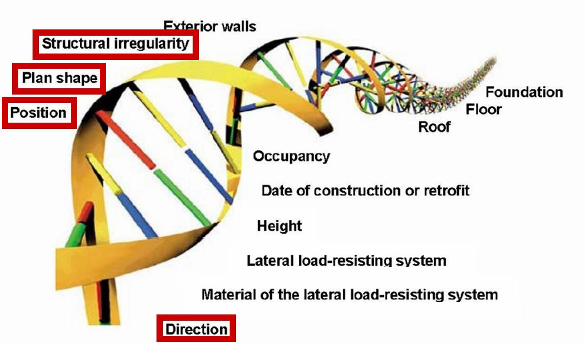
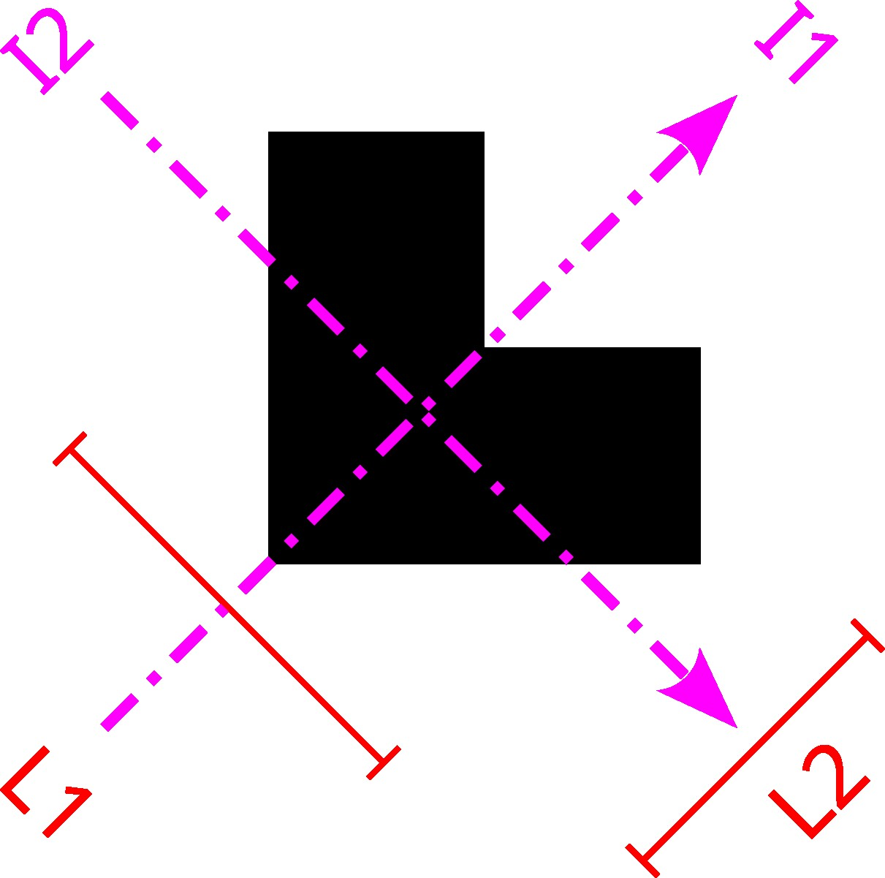
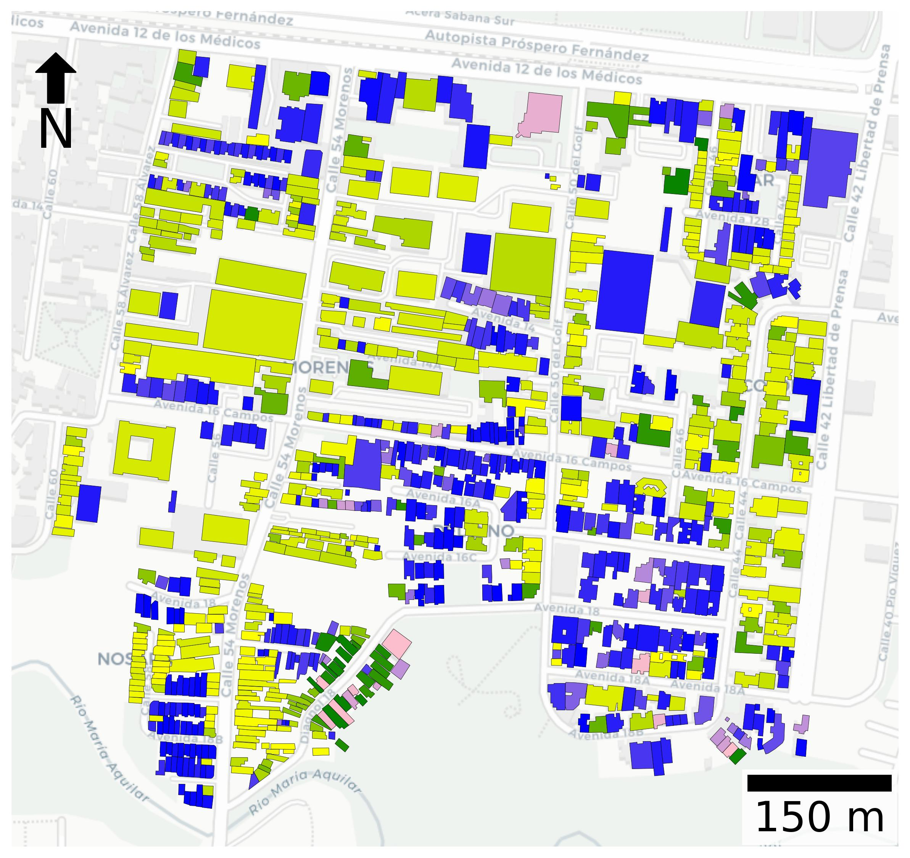
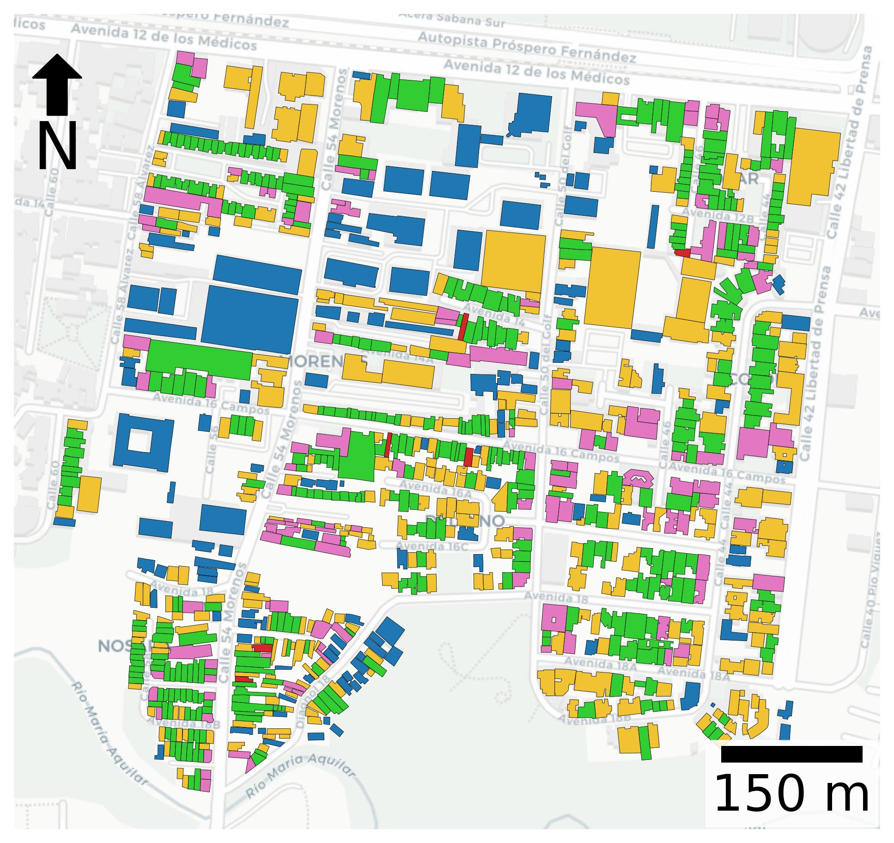
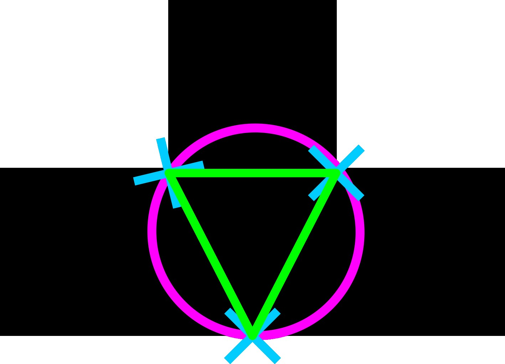
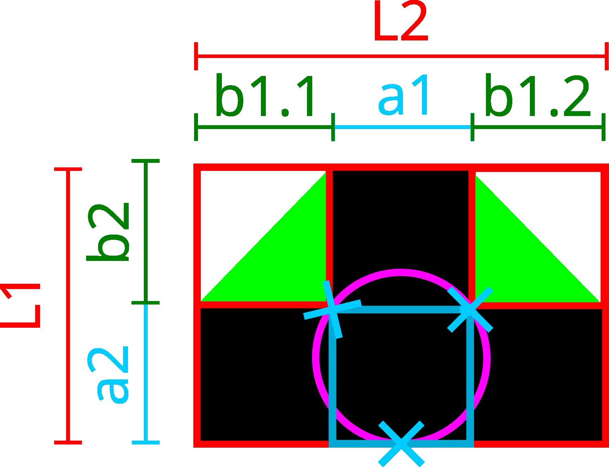
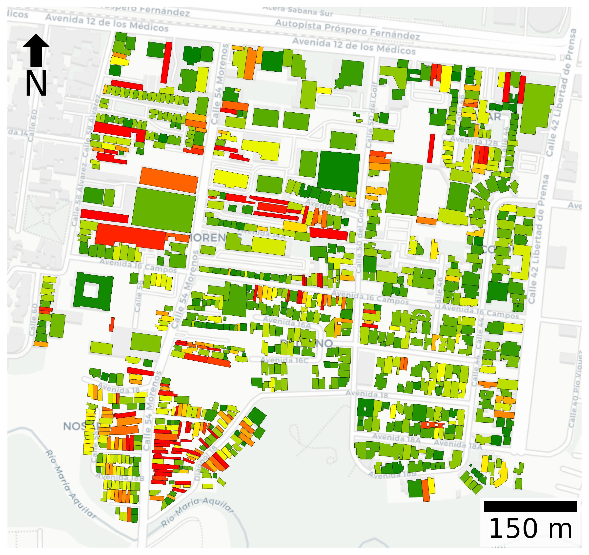
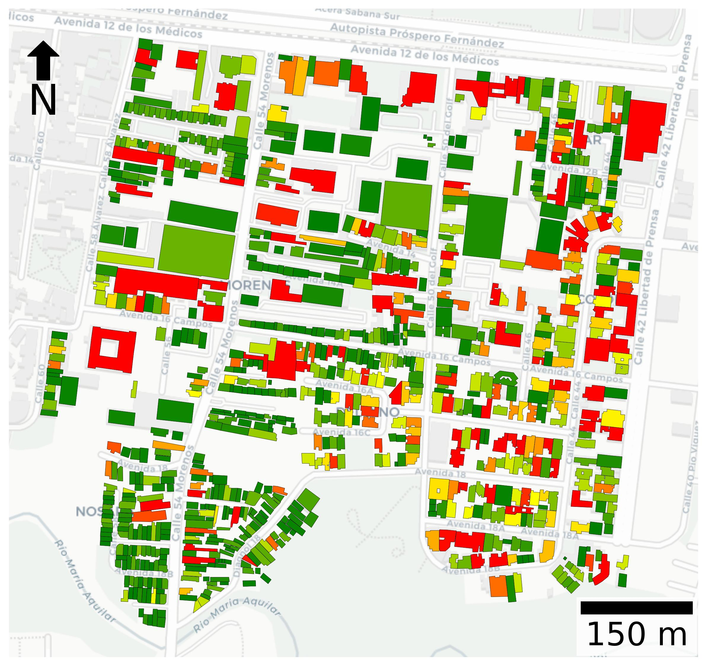

# footprint_attributes

<p align="center">
  
</p>

Automated computation of **seismic behaviour modifiers** from 2-D building footprint polygons, implementing the methodology described in:

> Ureña-Pliego, M., Rodríguez-Saiz, J., Núñez-Álvarez, G., Marchamalo-Sacristán, M., González-Rodrigo, B. (2026).
> *A methodology for the automated estimation of footprint-derived seismic behaviour modifiers in building exposure assessment.*
> Advanced Modeling and Simulation in Engineering Sciences, 13:3. [doi.org/10.1186/s40323-026-00323-y](https://link.springer.com/content/pdf/10.1186/s40323-026-00323-y.pdf)

Developed by the [Advanced Geomatics group (AGA)](https://blogs.upm.es/aga/en/) at the Universidad Politécnica de Madrid. See [Citation](#citation) below for the full author list, ORCIDs, and funding.

> **Footprint digitalisation** (Mask2Former / SAM2 instance segmentation) is out of scope for this package and lives elsewhere; this package starts from an already-digitised footprint geometry file.

---

## Why this package?

Seismic risk models require, for each building, a set of *behaviour modifiers* — attributes that adjust the base vulnerability of a structural typology. Several of these modifiers are derivable directly from a building's 2-D footprint, but their calculation usually requires subjective expert judgement based on seismic codes.

<p align="center">
  
  <br>
  <em>GEM building-taxonomy attributes. Red boxes mark the ones automated by this package: direction, position, plan shape and structural irregularity.</em>
</p>

This package translates the relevant code provisions into deterministic geometric algorithms, making the assessment **objective, reproducible, and scalable** to national-level inventories.

---

## What is computed?

### 1 · Building direction — `direction`

The orientation of the footprint's principal axes, via two independent methods:

- `direction.bbox` — axes of the minimum rotated bounding box.
- `direction.inertia` — principal axes of the second moment of area (exact closed-form). The *weak* axis (smaller moment) defines the building's `bearing`.

<p align="center">
  &nbsp;&nbsp;
  
</p>
<p align="center"><em>Left: principal axes of inertia. Right: minimum bounding box axes.</em></p>

<p align="center">
  
</p>

### 2 · Relative position within the block — `position`

Each building is classified into one of five categories using a **contact-force analogy**: a virtual unit pressure is applied to every shared wall segment, and the resultant force, confinement ratio, and angular-acceleration proxy decide the class.

<p align="center">
  
</p>

| Class | Meaning |
|---|---|
| **isolated** | No touching neighbours |
| **lateral** | Touches on one side |
| **corner** | Touches on two perpendicular sides |
| **confined** | Touches on both lateral sides (enclosed) |
| **torque** | Confined or corner with large angular acceleration |

<p align="center">
  
</p>

### 3 · Footprint shape indices — `shape`

Plan-irregularity parameters from **five international seismic codes**, plus three code-independent compactness indices (`polsby_popper`, `convex_hull_irregularity`, `inertia_circle_ratio`).

#### Structural model

All shape indices are computed under a *hollow-box* approximation: continuous uniform walls of height 3 m, one ceiling slab, identical materials throughout.

<p align="center">
  
</p>

The **centre of mass** is the area-weighted average of the ceiling centroid and the perimeter centroid. The **centre of stiffness** is the perimeter centroid (boundary of the footprint).

#### Basic plan dimensions

Setback and slenderness parameters build on a common construction: the inscribed circle for the main shape element `a` (fig. below), and the convex-hull difference for setback pieces `b`/`c`.

<p align="center">
  &nbsp;&nbsp;&nbsp;
</p>
<p align="center"><em>Process to find the main-element side <code>a</code>: inscribe the largest circle, find its tangent points, circumscribe a rectangle along the footprint's own principal axes.</em></p>

<p align="center">
  
</p>

#### Supported codes

| Code | `shape.<NORM>` | Parameters |
|---|---|---|
| **Eurocode 8** (EN 1998-1) | `EC8` | eccentricity ratio, radius ratio, compactness |
| **Costa Rica CSCR 2010** | `CSCR2010` | eccentricity ratio |
| **Italian GNDT Level II** | `GNDTII` | β₁ (main-shape slenderness), β₂ (setback ratio), β₄ (eccentricity ratio), β₆ (setback slenderness) |
| **US ASCE 7** | `ASCE7` | setback ratio, hole ratio, parallelity angle |
| **Mexican NTC-23** | `NTC23` | setback ratio, hole ratio |

Plan and vertical slenderness (`shape.slenderness`) and the code-independent indices apply across codes rather than belonging to one.

<p align="center">
  &nbsp;&nbsp;
  
</p>

Each code parameter has a matching `compliance_{NORM}_{param}` column (0–100 score against the code's own limit).

---

## Installation

Pinned to the [v1.0.0 release](https://github.com/GeomaticsCaminosUPM/footprint_attributes/releases/tag/v1.0.0):

```bash
pip install "footprint-attributes @ git+https://github.com/GeomaticsCaminosUPM/footprint_attributes.git@v1.0.0"
```

Dependencies: `geopandas`, `shapely>=2.0`, `numpy`, `pandas`, `scipy`, `scikit-learn`, `statsmodels`, `tabulate`.

---

## Quick start

```python
import geopandas as gpd
from footprint_attributes import direction, shape, position
import footprint_attributes

footprints = gpd.read_file("footprints.gpkg")

# ── Building direction ─────────────────────────────────────────────────────
footprints["bearing"] = direction.inertia(footprints)

# ── Relative position within the block ─────────────────────────────────────
footprints = position(footprints, buffer=0.1, height_column="height")

# ── Eurocode 8 shape indices ────────────────────────────────────────────────
ec8 = shape.EC8(footprints)
footprints["EC8_compactness"] = ec8["EC8_compactness"]
footprints["EC8_eccentricityRatio"] = ec8["EC8_eccentricityRatio"]

# ── Or a single entry point: request any mix of columns in one call ────────
result = footprint_attributes.run(
    footprints,
    config={"columns": ["EC8", "position", "bearing"]},
)

footprints.to_file("results.gpkg")
```

See the [`examples/`](examples/) notebooks for full walkthroughs of every module on real footprint data, and the [Sphinx docs](docs/) for the complete API reference.

---

## Repository layout

```
footprint_attributes/
├── src/footprint_attributes/
│   ├── __init__.py       # public entry points: direction, shape, position, run
│   ├── direction.py       # building orientation (bbox / inertia methods)
│   ├── shape.py            # seismic-code shape indices (EC8, ASCE7, GNDTII, CSCR2010, NTC23)
│   ├── position.py         # contact forces + relative-position classification
│   ├── eccentricity.py     # Mohr's-circle worst-case eccentricity optimisation
│   ├── geometry.py          # shared low-level geometry primitives
│   ├── config.py            # code limits, compliance grades, default thresholds
│   └── runner.py             # `run()` single entry point
├── examples/
│   ├── direction.ipynb, position.ipynb, shape.ipynb, building_sizes.ipynb
│   └── data/                 # sample footprints, one file per pilot area:
│       ├── san_jose_pilot_region.gpkg
│       ├── guatemala_pilot_region.gpkg
│       └── santo_domingo_pilot_region.gpkg
├── docs/                     # Sphinx documentation (Google-style autodoc + notebooks)
├── tests/                    # pytest suite
└── figures/                   # images used in this README, the docs, and the paper
```

---

## Documentation

Full API reference (Google-style docstrings via Sphinx/autodoc) and rendered example notebooks:

```bash
uv sync --group docs
uv run sphinx-build -b html docs docs/_build/html
```

---

## Validation

The methodology was validated against hand-labelled building inventories from three Central-American / Caribbean pilot areas (San José, Santo Domingo, Guatemala City).

<p align="center">
  
</p>

The automated shape and position classifications were found to be comparable in accuracy to the variability observed between independent human surveyors.

---

## Citation

If you use this package in research, please cite the paper:

> Ureña-Pliego, M., Rodríguez-Saiz, J., Núñez-Álvarez, G., Marchamalo-Sacristán, M., González-Rodrigo, B. (2026).
> A methodology for the automated estimation of footprint-derived seismic behaviour modifiers in building exposure assessment.
> *Advanced Modeling and Simulation in Engineering Sciences*, 13:3.
> https://doi.org/10.1186/s40323-026-00323-y — [PDF](https://link.springer.com/content/pdf/10.1186/s40323-026-00323-y.pdf)

```bibtex
@article{urena-pliego2026footprint,
  author  = {Ure{\~n}a-Pliego, Miguel and Rodr{\'i}guez-Saiz, Javier and N{\'u}{\~n}ez-{\'A}lvarez, Gonzalo
             and Marchamalo-Sacrist{\'a}n, Miguel and Gonz{\'a}lez-Rodrigo, Beatriz},
  title   = {A methodology for the automated estimation of footprint-derived seismic behaviour
             modifiers in building exposure assessment},
  journal = {Advanced Modeling and Simulation in Engineering Sciences},
  year    = {2026},
  volume  = {13},
  number  = {3},
  doi     = {10.1186/s40323-026-00323-y},
  url     = {https://doi.org/10.1186/s40323-026-00323-y}
}
```

### Authors

| Author | ORCID | Affiliation |
|---|---|---|
| Miguel Ureña-Pliego | [0000-0001-6594-2566](https://orcid.org/0000-0001-6594-2566) | Dept. of Land Morphology and Engineering, ETSI Caminos, Canales y Puertos, UPM |
| Javier Rodríguez-Saiz | [0009-0004-1054-8608](https://orcid.org/0009-0004-1054-8608) | Dept. of Land Morphology and Engineering, ETSI Caminos, Canales y Puertos, UPM; Buin Ingenieros SL |
| Gonzalo Núñez-Álvarez | [0009-0000-1912-0465](https://orcid.org/0009-0000-1912-0465) | Dept. of Building Structures and Physics, ETSI Arquitectura, UPM |
| Miguel Marchamalo-Sacristán | [0000-0001-9237-4146](https://orcid.org/0000-0001-9237-4146) | Dept. of Land Morphology and Engineering, ETSI Caminos, Canales y Puertos, UPM |
| Beatriz González-Rodrigo | [0000-0003-1038-7459](https://orcid.org/0000-0003-1038-7459) | Dept. of Forestry and Environmental Engineering and Management, ETSI Montes, Forestal y del Medio Natural, UPM |

Developed within the **[Advanced Geomatics group (AGA)](https://blogs.upm.es/aga/en/)**, Universidad Politécnica de Madrid.

### Funding

This research was supported by the Industrial Doctorates of the Community of Madrid (grant number IND2023/TIC-28743); by the European Union project 9063-03 "Adelante 2" (Sustainable and resilient construction in Central America and the Caribbean in the face of seismic hazard: regional cooperation based on the experience of Costa Rica); by the SIAGUA Project (reference PID2021-128123OB-C22), funded by MCIN/AEI/10.13039/501100011033 and by "ERDF A way of making Europe"; and by the Spanish State Research Agency (AEI) of the Ministry of Science, Innovation and Universities under project RISK-CARIBERIA (PID2024-155792OB-I00), within the 2025 "Knowledge Generation" Call of the Spanish State Plan for Scientific, Technical and Innovation Research.

---

## License

MIT.
