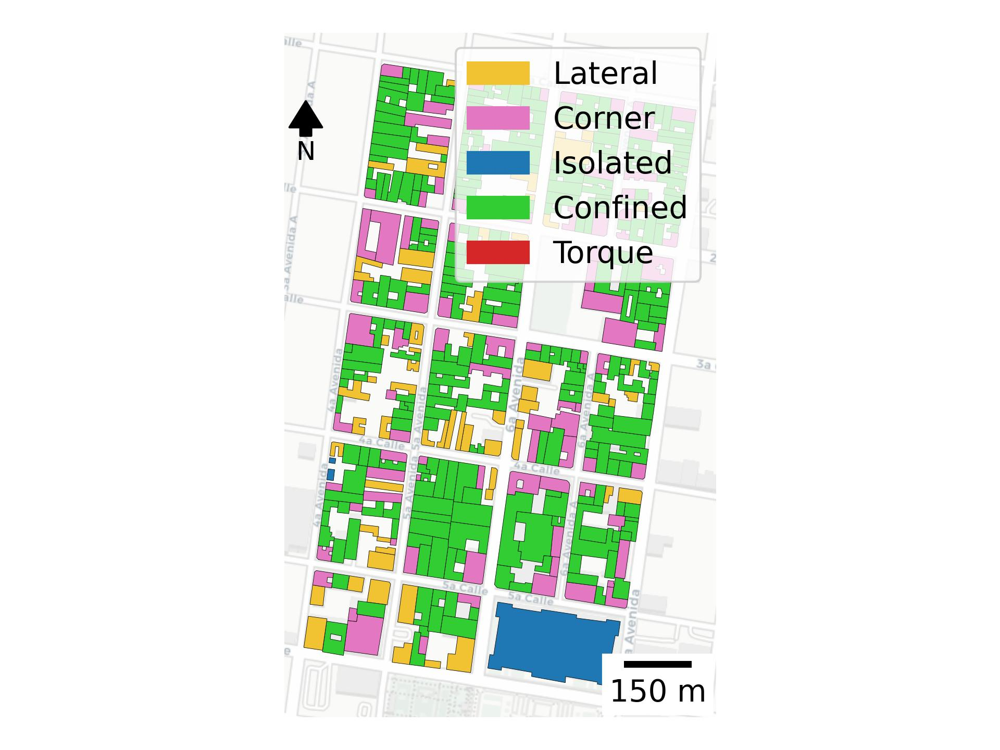
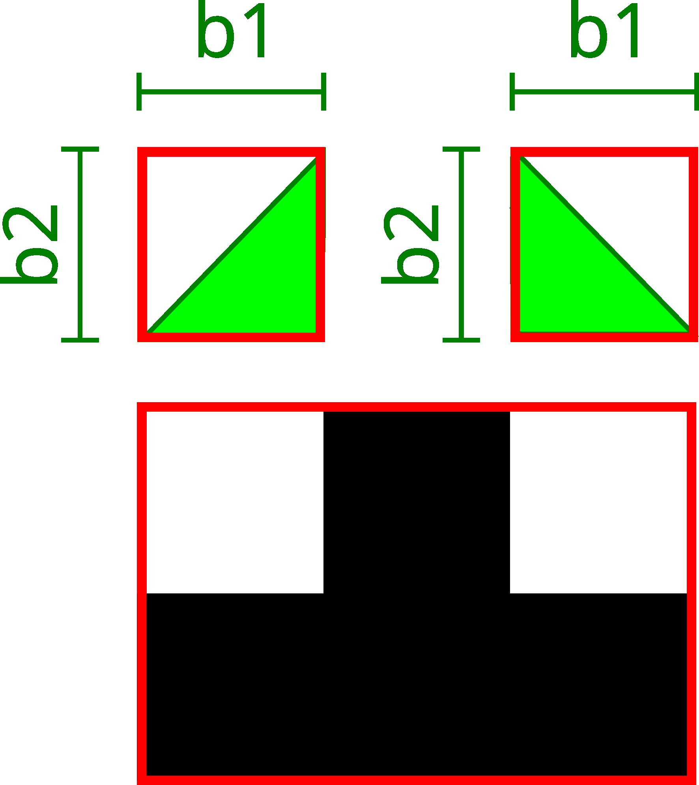

Concepts
========

A conceptual walkthrough of the three things this package computes --
building direction, relative position, and footprint shape indices -- with
the figures and interactive maps the example notebooks build along the way.
For the exact formulas and source code behind every column, see
:doc:`formulas`; for the notebooks themselves, see :doc:`examples`.

Building direction (axis methods)
----------------------------------

Two independent methods give each footprint a pair of axes
:math:`(L_1, \text{dir}_1, L_2, \text{dir}_2)` -- :func:`~footprint_attributes.direction.bbox`
(minimum rotated bounding box) and :func:`~footprint_attributes.direction.inertia`
(principal axes of the second moment of area). They usually agree closely
for a simple rectangular footprint, and can diverge for an irregular one --
several other columns (``bearing``, the eccentricity/setback/slenderness
parameters) let you pick which convention drives them.

.. image:: ../figures/axis_inertia_2.jpg
   :width: 31%
.. image:: ../figures/axis_inertia_3.jpg
   :width: 31%

*Left to right: the second-moment-of-area tensor, its principal axes, and
the resulting* ``dir1``/``dir2`` *pair -- see* :doc:`formulas` *for why the
eigenvector roles are swapped relative to the raw eigendecomposition.*

.. image:: ../figures/direction_san_jose.jpg
   :width: 80%
   :align: center

``direction.ipynb`` builds the map above (``bearing``, plus both axis
conventions as arrow overlays) for all three pilot regions -- see it live,
switch dataset/attribute, and orbit the camera in 3D:

.. raw:: html

   <iframe src="_static/maps/index.html" width="100%" height="560" style="border:1px solid #444;" loading="lazy"></iframe>

Relative position within the block
------------------------------------

A building's neighbours change how it behaves in an earthquake: isolated
buildings sway freely, confined ones are restrained but may pound against
their neighbours, and a corner-touched one can twist. Each building is
classified by a contact-force analogy -- a virtual unit pressure applied to
every shared wall segment -- into isolated / lateral / corner / confined /
torque.

.. image:: ../figures/relative_position_explanation.jpg
   :width: 45%
   :align: center

.. image:: ../figures/relative_position_san_jose.jpg
   :width: 55%

*Every building in a real urban block, coloured by its computed*
``relativePosition`` *class (right: one block, with legend).*

``position.ipynb`` computes this (plus the underlying contact-force
vectors, drawn as arrows) for all three pilot regions. Switch "Color by" to
**Relative position** in the map above, or tick the **Position force
arrows** overlay, to see the same classification and forces this package
computes live from the raw footprints.

Footprint shape indices
-------------------------

Plan-irregularity parameters from five international seismic codes (EC8,
ASCE 7, GNDT-II, CSCR 2010, NTC-23), plus three code-independent
compactness indices, all computed under a *hollow-box* idealisation
(uniform walls, one ceiling slab):

.. image:: ../figures/box_idealization_and_eccentricity.jpg
   :width: 55%
   :align: center

Setback and slenderness parameters build on a common construction: inscribe
the largest circle that fits the footprint, find its tangent points, then
circumscribe a rectangle along the footprint's own principal axes -- the
main-element side ``a``:

.. image:: ../figures/circle_step_1.jpg
   :width: 23%
.. image:: ../figures/circle_step_2.jpg
   :width: 23%
.. image:: ../figures/circle_step_3.jpg
   :width: 23%
.. image:: ../figures/circle_step_4.jpg
   :width: 23%

Setback pieces ``b``/``c`` instead come from ``convex_hull(footprint) -
footprint``, each disconnected piece measured against its own circumscribed
rectangle:

.. image:: ../figures/setback_step_1.jpg
   :width: 45%

.. image:: ../figures/basic_lengths_example.jpg
   :width: 60%
   :align: center

``shape.ipynb`` and ``building_sizes.ipynb`` build these constructions (as
static FancyFolium maps with the raw ``L1``/``L2``/``a1``/``a2``/``b``/``c``
dimension lines) and the full shape-index set for all three pilot regions.
In the map above, switch "Color by" to **Shape index** or any of the 15
individual metrics, and tick **Convex hull** / **Bounding box** / **Building
lengths** to see the same constructions drawn directly on the buildings:

.. image:: ../figures/slenderness_san_jose.jpg
   :width: 46%
.. image:: ../figures/eccentricity_san_jose.jpg
   :width: 46%

.. image:: ../figures/hole_ratio.jpg
   :width: 45%
   :align: center

*`ASCE7`'s hole ratio compares a hole's own bounding box against the
building's; `NTC23`'s instead compares the hole's short side to the
building's own cross-section through it.*
