Concepts
========

A visual walkthrough of what this package computes -- **building
direction**, **relative position within the block**, **basic plan
dimensions** and **footprint shape indices** -- each shown first on
hand-built test shapes with a known answer, then on the three real pilot
regions: Guatemala City (Zona 10), San José (Mata Redonda) and Santo Domingo
(Ensanche Quisquella). These are the same plots the :doc:`examples`
notebooks build. For the exact formula and source code behind every column,
see :doc:`formulas`.

.. contents:: On this page
   :local:
   :depth: 1

Building direction
------------------

*Module:* :mod:`footprint_attributes.direction` *· notebook:*
:doc:`examples/direction`

Every footprint has a natural "long way" and "short way". Two independent
methods find this pair of axes :math:`(L_1, \text{dir}_1, L_2, \text{dir}_2)`
for an arbitrary footprint:

- :func:`~footprint_attributes.direction.bbox` -- the sides of the smallest
  rotated rectangle that contains the footprint;
- :func:`~footprint_attributes.direction.inertia` -- the principal axes of
  the second moment of area: the footprint treated as a flat plate and
  balanced. It is less affected than ``bbox`` by a single protruding corner.

``bearing`` is the compass heading of the *short* axis, in degrees
clockwise from North, folded to :math:`[-90°, 90°]`.

.. image:: figures/axis_inertia_1.jpg
   :width: 31%
.. image:: figures/axis_inertia_2.jpg
   :width: 31%
.. image:: figures/axis_inertia_3.jpg
   :width: 31%

*Left to right: the second-moment-of-area tensor, its principal axes, and
the resulting* ``dir1``/``dir2`` *pair.*

**Checked on shapes with a known answer.** A 20 × 10 m rectangle rotated
by a known angle must return ``bearing = −angle`` with both methods:

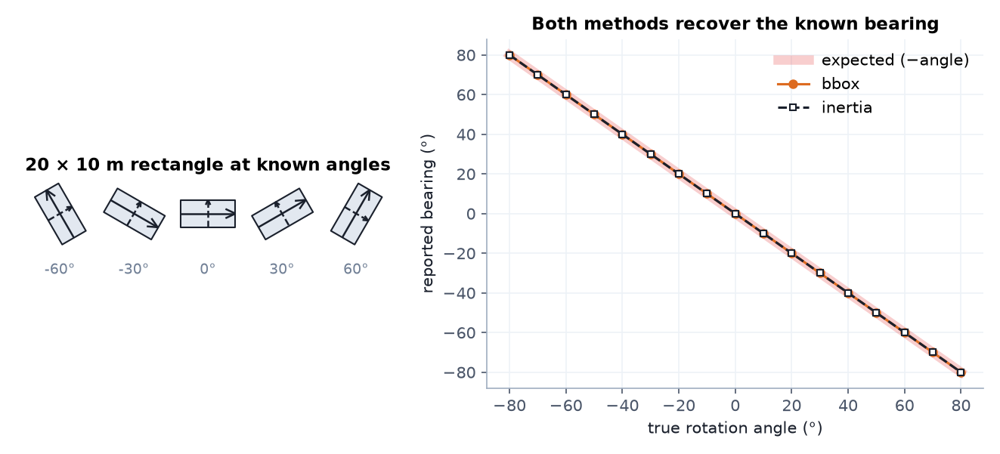

   Both methods recover the known bearing across the full range of angles.

On non-rectangular plans the two methods can disagree -- and the minimum
bounding box is not always the "upright" one you would draw by eye:

.. figure:: figures/direction_methods_test_shapes.png
   :width: 100%
   :alt: bbox vs inertia axes on L, T, X and asymmetric-L test shapes

   Minimum bounding box and its axes (orange) vs. principal axes of
   inertia (dashed).

**On real data.** On real footprints the two methods agree for most
buildings; the ones that differ are irregular or nearly square plans:

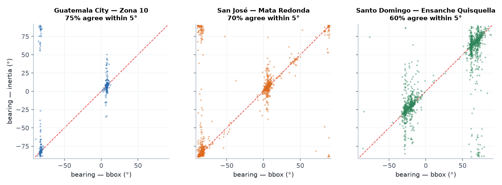

   ``bearing`` from ``bbox`` vs. ``inertia`` for every building.

.. figure:: maps/bearing.jpg
   :width: 100%
   :alt: Map of building bearing in the three pilot regions

   ``bearing`` (inertia) mapped: buildings along the same street share a
   colour. The ramp is cyclic because −90° and +90° are the same axis.

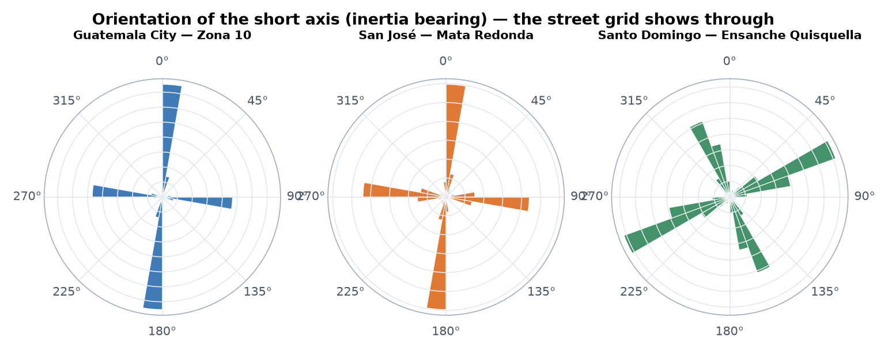

   Orientation roses: each region's street grid appears as two peaks 90°
   apart.

.. figure:: maps/detail_direction.jpg
   :width: 100%
   :alt: Close-up map with bounding boxes and inertia axes drawn on buildings

   Close-up: both constructions drawn on real buildings.

**Explore it live.** San José with the bounding-box and inertia-axis overlays on, coloured by slenderness. Drag to orbit and click a building for its values:

.. raw:: html

   <iframe src="_static/maps/index.html?dataset=san_jose&attribute=slenderness_inertia&overlays=bounding_box,inertia_axis&zoom=17&view=2d" width="100%" height="520" style="border:1px solid #cbd5e0;border-radius:6px;" loading="lazy"></iframe>

Relative position within the block
-----------------------------------

*Module:* :mod:`footprint_attributes.position` *· notebook:*
:doc:`examples/position`

A building's neighbours change how it behaves in an earthquake: an isolated
building sways freely, a confined one is restrained but may pound against
its neighbours, and one touched unevenly can twist. Each building is
classified with a **contact-force analogy**: a virtual unit pressure pushes
on every wall it shares with a neighbour. How strong the resulting push is,
how much it cancels itself out, and how much it would twist the building
decide the class.

.. image:: figures/relative_position_explanation.jpg
   :width: 45%
   :align: center

.. list-table::
   :header-rows: 1
   :widths: 15 85

   * - Class
     - Meaning
   * - ``isolated``
     - no touching neighbours -- free-standing
   * - ``lateral``
     - pushed from one side
   * - ``corner``
     - pushed from two non-opposite sides (a corner plot)
   * - ``confined``
     - pushed from opposite sides that largely cancel (hemmed in)
   * - ``torque``
     - corner/confined, but so unevenly that the building would twist

**Checked on shapes with a known answer.** One hand-built scenario per
class; the classifier must return the scenario's own name:

.. figure:: figures/position_scenarios.png
   :width: 100%
   :alt: Five hand-built scenarios with contact-force arrows and computed class

   Thin arrows: the pressure on each shared wall; thick arrow: the
   resultant. Every scenario is classified correctly.

**On real data.**

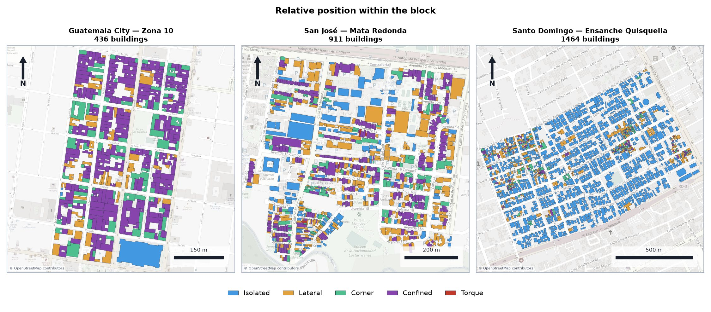

   ``relativePosition`` for every building. Guatemala's compact colonial
   blocks are mostly confined; Santo Domingo's detached houses are mostly
   isolated.

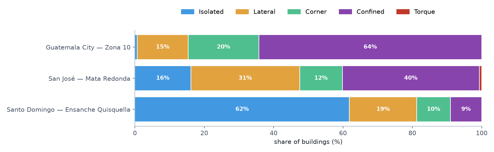

   Class shares per pilot region.

.. figure:: maps/detail_contact_forces.jpg
   :width: 100%
   :alt: Close-up map with per-wall contact forces and resultants

   Close-up: the per-wall forces and their resultant on real buildings.

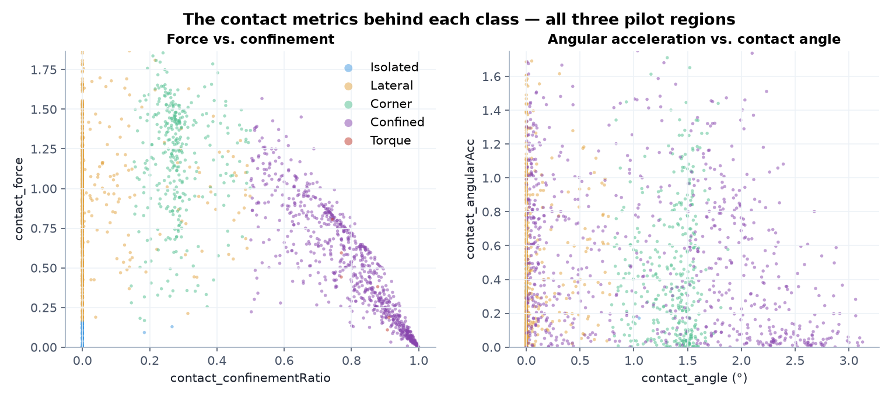

   The contact metrics behind each class.

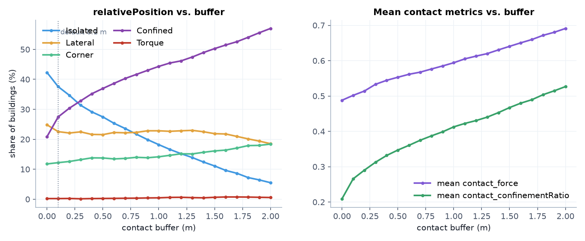

   Sensitivity to ``buffer`` -- how far apart two footprints can be and
   still count as touching.

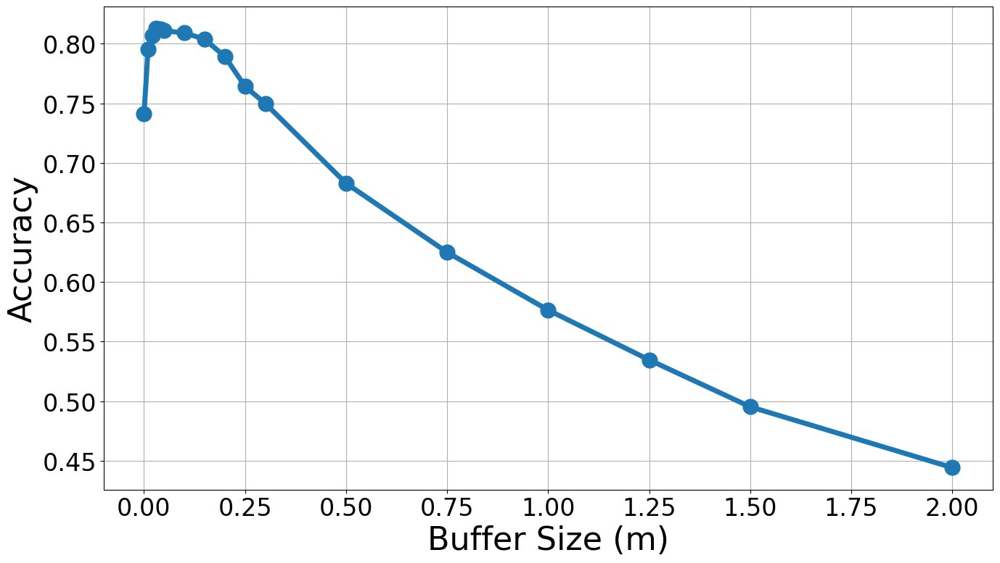

   From the paper: classification accuracy against the hand-labelled
   inventories as a function of the contact buffer -- it peaks at around
   0.05–0.1 m, hence the 0.1 m default.

**Explore it live.** Guatemala City coloured by ``relativePosition``, with the net contact-force arrow of every building:

.. raw:: html

   <iframe src="_static/maps/index.html?dataset=guatemala&attribute=relativePosition&overlays=position_arrows&zoom=17" width="100%" height="520" style="border:1px solid #cbd5e0;border-radius:6px;" loading="lazy"></iframe>

Basic plan dimensions
----------------------

*Module:* :mod:`footprint_attributes.geometry` *· notebook:*
:doc:`examples/building_sizes`

Setback and slenderness parameters are built from a handful of lengths
read off each footprint: its overall dimensions :math:`L_1, L_2`, the sides
:math:`a_1, a_2` of its main rectangular element, and the size :math:`b, c`
of the largest setback. The main element comes from the largest circle that
fits inside the footprint:

.. image:: figures/circle_step_1.jpg
   :width: 23%
.. image:: figures/circle_step_2.jpg
   :width: 23%
.. image:: figures/circle_step_3.jpg
   :width: 23%
.. image:: figures/circle_step_4.jpg
   :width: 23%

*Inscribe the largest circle, find its tangent points, and circumscribe a
rectangle along the footprint's own axes -- the main element.* Setback
pieces come from ``convex_hull(footprint) − footprint``, each measured
against its own circumscribed rectangle:

.. image:: figures/setback_step_1.jpg
   :width: 45%
.. image:: figures/setback_step_2.jpg
   :width: 45%

The full construction on four prototype plans (L, T, Q, LT):

.. image:: figures/L_3.jpg
   :width: 24%
.. image:: figures/T_3.jpg
   :width: 24%
.. image:: figures/Q_3.jpg
   :width: 24%
.. image:: figures/LT_3.jpg
   :width: 24%

**Checked on shapes with a known answer.** The package's own computation
on the hand-built test shapes -- the asymmetric L is built so its setback
ratio is exactly 0.40:

.. figure:: figures/basic_lengths_test_shapes_bbox.png
   :width: 100%
   :alt: Basic lengths on the L, T, X and asymmetric-L test shapes

   Every basic length drawn on the test shapes, with the setback pieces
   (hatched) and the inscribed circle.

.. figure:: figures/basic_lengths_test_shapes_inertia.png
   :width: 100%
   :alt: Basic lengths measured along the principal axes of inertia

   The same, measured along the principal axes of inertia.

**On real data.**

.. figure:: maps/detail_basic_lengths.jpg
   :width: 100%
   :alt: Close-up map with basic-length dimension lines on real buildings

   Basic lengths on real irregular buildings.

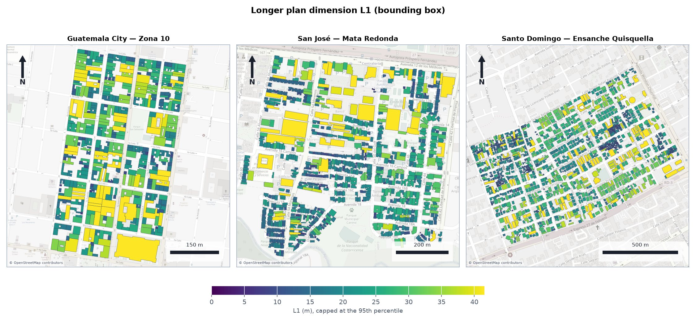

   ``L1`` -- the longer plan dimension.

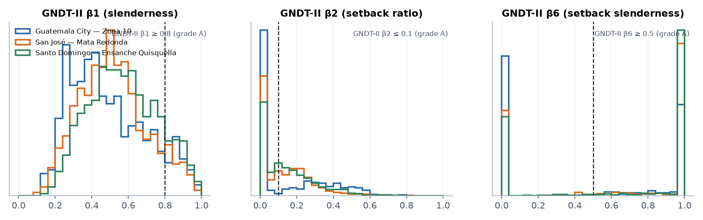

   The GNDT-II ratios built on these lengths.

**Explore it live.** Santo Domingo with every building's basic lengths drawn, coloured by GNDT-II β2 (setback ratio):

.. raw:: html

   <iframe src="_static/maps/index.html?dataset=santo_domingo&attribute=GNDTII_beta2_setbackRatio&overlays=basic_lengths&zoom=17.5&view=2d" width="100%" height="520" style="border:1px solid #cbd5e0;border-radius:6px;" loading="lazy"></iframe>

Footprint shape indices
------------------------

*Module:* :mod:`footprint_attributes.shape` *· notebook:*
:doc:`examples/shape`

Plan-irregularity parameters from five international seismic codes -- EC8,
ASCE 7, GNDT-II, CSCR 2010 and NTC-23 -- plus three code-independent
compactness indices. Code parameters are computed under a *hollow-box*
idealisation: uniform walls and one slab. The offset between the centre of
mass and the centre of stiffness is the eccentricity that makes a building
twist:

.. image:: figures/box_idealization_and_eccentricity.jpg
   :width: 55%
   :align: center

.. figure:: figures/shape_centre_of_mass_stiffness.png
   :width: 100%
   :alt: Centre of mass and stiffness on four test shapes

   Centre of mass vs. centre of stiffness on the test shapes, with the
   resulting EC8 and CSCR 2010 eccentricity ratios.

**Checked on shapes with a known answer.**

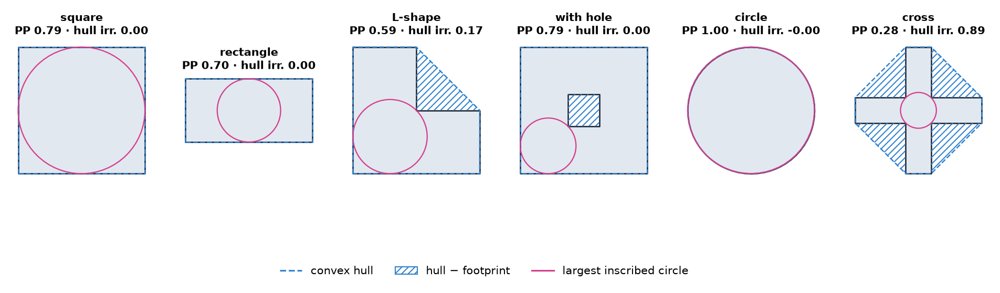

   Idealised shapes: a circle has Polsby–Popper 1, a square π/4 ≈ 0.785,
   and the thin cross is far from convex.

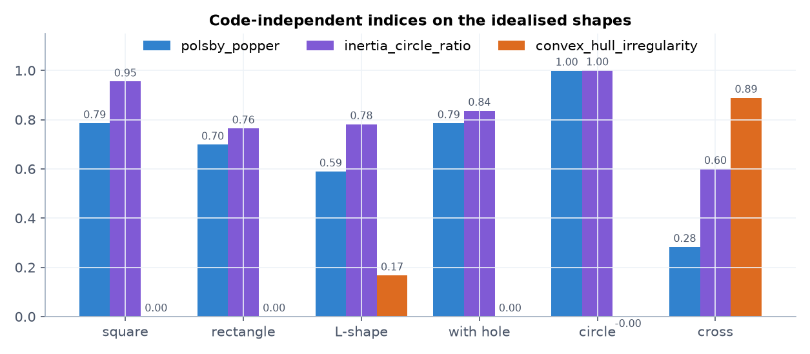

   The three code-independent indices on the same shapes.

**On real data.** The *shape index* condenses three code checks into one
label per building. Buildings are ``regular`` unless the EC8 eccentricity
ratio exceeds 0.3, the ASCE 7 setback ratio exceeds 0.2, or the slenderness
exceeds 4:

.. figure:: maps/shape_index.jpg
   :width: 100%
   :alt: Map of the shape index in the three pilot regions

   The shape index for every building.

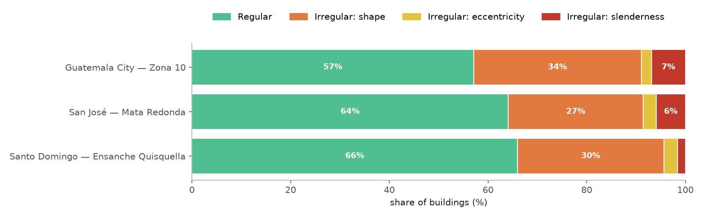

   Shape-index shares per pilot region.

.. figure:: maps/EC8_eccentricityRatio.jpg
   :width: 100%
   :alt: Map of the EC8 eccentricity ratio

   EC8 eccentricity ratio against its 0.30 limit (green complies, red
   exceeds). Every one of the 15 code metrics has a map like this in
   :doc:`formulas`.

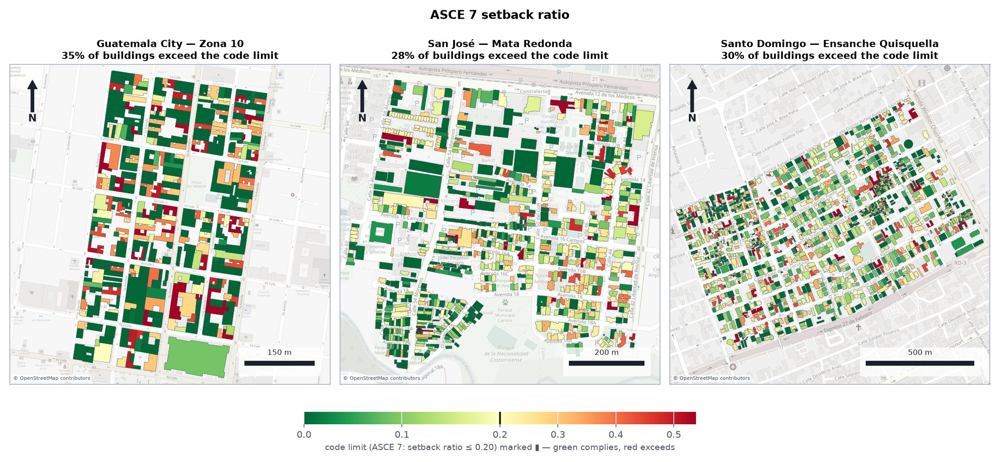

   ASCE 7 setback ratio against its 0.20 limit.

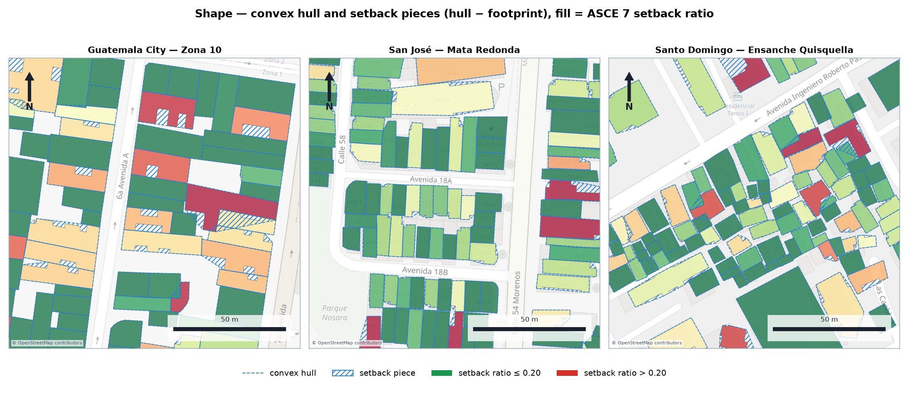

   Close-up: convex hulls and setback pieces on real buildings.

.. figure:: figures/shape_code_exceedance.png
   :width: 85%
   :alt: Share of buildings exceeding each code limit

   How often each code limit is exceeded, per pilot region.

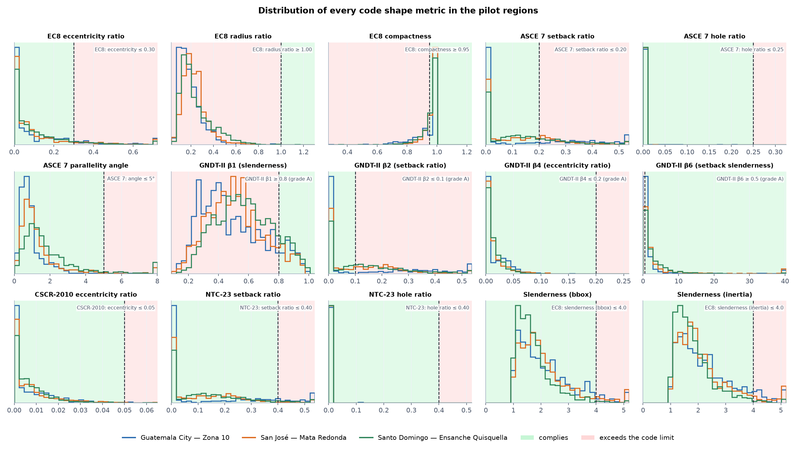

   Distribution of every code metric, with the compliant and exceeding
   ranges shaded.

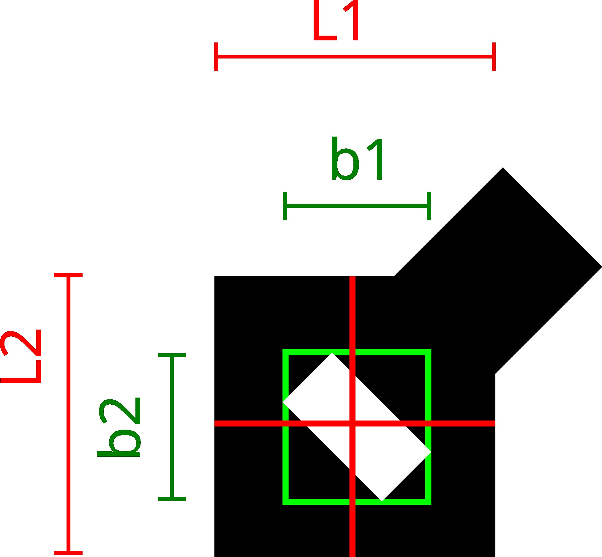

   ASCE 7's hole ratio compares a hole's own bounding box with the
   building's; NTC-23's compares the hole's short side with the building's
   own cross-section through it.

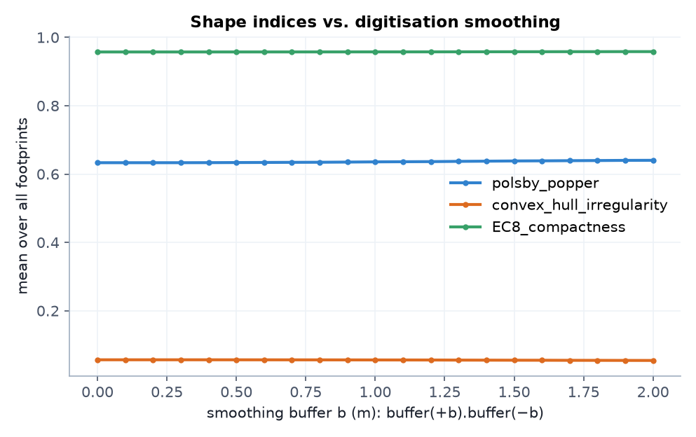

   Robustness to digitisation noise: mean index after smoothing every
   footprint with ``buffer(+b).buffer(−b)``.

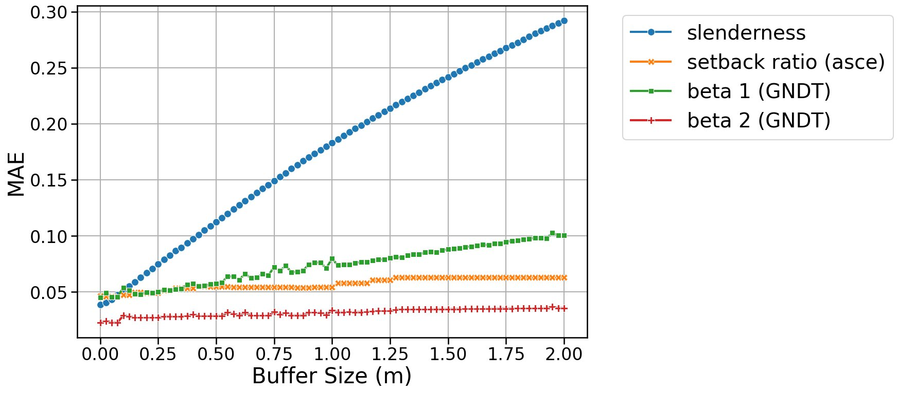

   From the paper: mean absolute error of four shape parameters as a
   function of the smoothing buffer size.

Explore it live
---------------

The shape index on San José with the convex hulls drawn. Switch "Color by"
to any of the 15 code metrics -- each has a norm-exceedance chart on the
right -- or press ▶ for the auto-playing tour of every attribute:

.. raw:: html

   <iframe src="_static/maps/index.html?dataset=san_jose&attribute=shape_index&overlays=convex_hull" width="100%" height="600" style="border:1px solid #cbd5e0;border-radius:6px;" loading="lazy"></iframe>
