Concepts
========

A visual walkthrough of what this package computes -- **block position**,
**building direction**, **basic plan dimensions** and **footprint shape
indices** -- each shown first on hand-built test shapes with a known
answer, then as a live, interactive 3-D/2-D map of the three real pilot
regions: Guatemala City (Zona 10), San José (Mata Redonda) and Santo
Domingo (Ensanche Quisquella). These are the same computations the
:doc:`examples` notebooks build. For the exact formula and source code
behind every column, see :doc:`formulas`.

.. contents:: On this page
   :local:
   :depth: 1

1 · Block position within the block
------------------------------------

*Module:* :mod:`footprint_attributes.position` *· notebook:*
:doc:`examples/position`

A building's neighbours change how it behaves in an earthquake: an isolated
building sways freely, a confined one is restrained but may pound against
its neighbours, and one touched unevenly can twist. Each building is
classified with a **contact-force analogy**: a virtual unit pressure pushes
on every wall it shares with a neighbour. How strong the resulting push is,
how much it cancels itself out, and how much it would twist the building
decide the class.

.. image:: figures/block_position_explanation.jpg
   :width: 45%
   :align: center

.. list-table::
   :header-rows: 1
   :widths: 15 85

   * - Class
     - Meaning
   * - ``isolated``
     - no touching neighbours -- free-standing
   * - ``lateral``
     - pushed from one side
   * - ``corner``
     - pushed from two non-opposite sides (a corner plot)
   * - ``confined``
     - pushed from opposite sides that largely cancel (hemmed in)
   * - ``torque``
     - corner/confined, but so unevenly that the building would twist

**Checked on shapes with a known answer.** One hand-built scenario per
class; the classifier must return the scenario's own name:

.. figure:: figures/position_scenarios.png
   :width: 100%
   :alt: Five hand-built scenarios with contact-force arrows and computed class

   Thin arrows: the pressure on each shared wall; thick arrow: the
   resultant. Every scenario is classified correctly.

**On real data -- the net contact force.** Every building, coloured by
``blockPosition``, with each wall's own contact-force arrow (thin, dotted)
and its resultant (thick). Toggle "Force arrows" in the panel, drag to pan,
scroll to zoom:

.. raw:: html

   <iframe src="_static/interactive/block_position_forces/index.html" width="100%" height="640" style="border:1px solid #cbd5e0;border-radius:6px;" loading="lazy"></iframe>

**In 3-D, touring every pilot region.** The same classification extruded
by building height, orbiting in 3-D; it moves on to the next pilot region
every 10 seconds on its own -- drag, zoom or click to take over:

.. raw:: html

   <iframe src="_static/interactive/block_position_3d/index.html" width="100%" height="640" style="border:1px solid #cbd5e0;border-radius:6px;" loading="lazy"></iframe>

2 · Building direction
-----------------------

*Module:* :mod:`footprint_attributes.direction` *· notebook:*
:doc:`examples/direction`

Every footprint has a natural "long way" and "short way". Two independent
methods find this pair of axes :math:`(L_1, \text{dir}_1, L_2, \text{dir}_2)`
for an arbitrary footprint:

- :func:`~footprint_attributes.direction.bbox` -- the sides of the smallest
  rotated rectangle that contains the footprint;
- :func:`~footprint_attributes.direction.inertia` -- the principal axes of
  the second moment of area: the footprint treated as a flat plate and
  balanced. It is less affected than ``bbox`` by a single protruding corner.

``bearing`` is the compass heading of the *short* axis, in degrees
clockwise from North, folded to :math:`[-90°, 90°]`.

.. image:: figures/axis_inertia_1.jpg
   :width: 31%
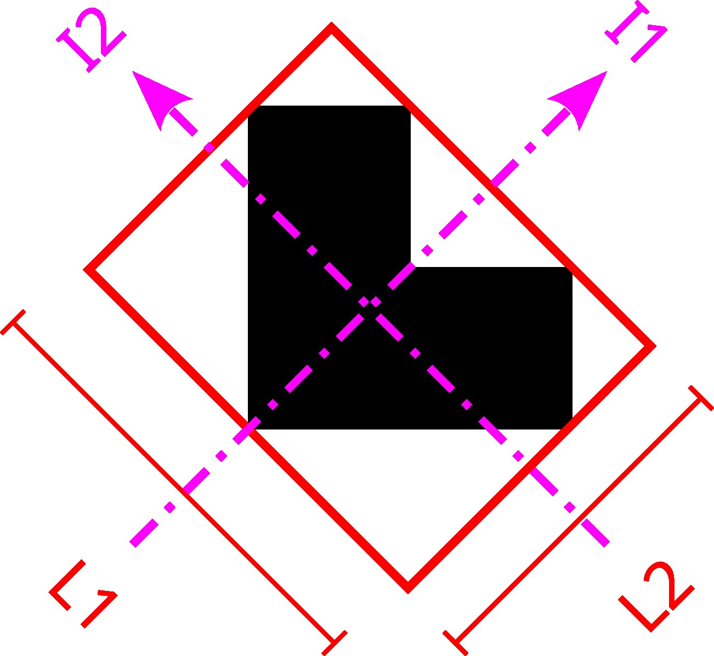
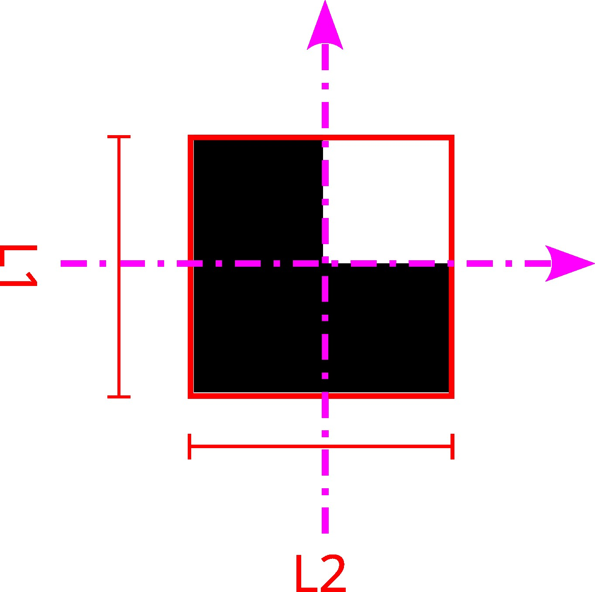

*Left to right: the second-moment-of-area tensor, its principal axes, and
the resulting* ``dir1``/``dir2`` *pair.*

**On real data.** Both axes drawn on every building -- the bounding-box
axis dotted (solid arrowhead), the inertia axis solid -- so you can see
directly where the two methods agree and where they don't. Buildings are
coloured by bearing (a full colour wheel, one turn per 180°, since an axis
has no front/back); it switches which method drives the colour every 5
seconds and moves to the next pilot region every 10:

.. raw:: html

   <iframe src="_static/interactive/direction/index.html" width="100%" height="640" style="border:1px solid #cbd5e0;border-radius:6px;" loading="lazy"></iframe>

3 · Basic plan dimensions
---------------------------

*Module:* :mod:`footprint_attributes.geometry` *· notebook:*
:doc:`examples/building_sizes`

Setback and slenderness parameters are built from a handful of lengths
read off each footprint: its overall dimensions :math:`L_1, L_2`, the sides
:math:`a_1, a_2` of its main rectangular element, and the size :math:`b, c`
of the largest setback. The main element comes from the largest circle that
fits inside the footprint:

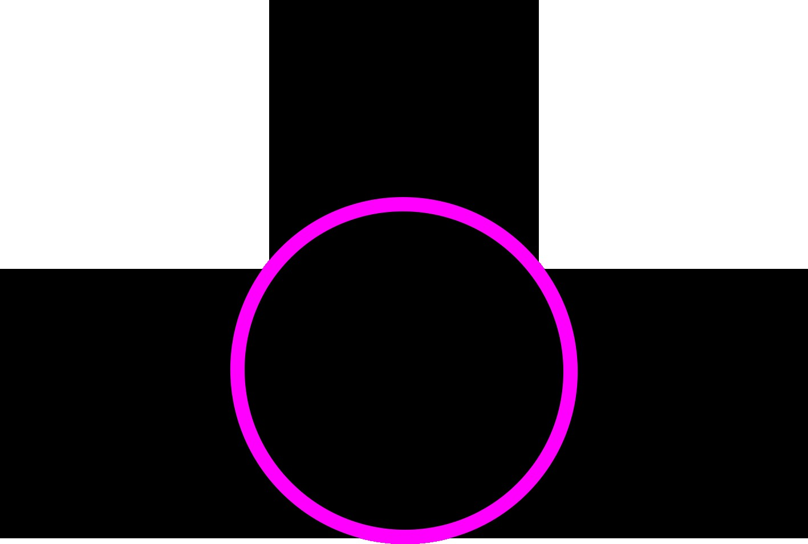
.. image:: figures/circle_step_2.jpg
   :width: 23%
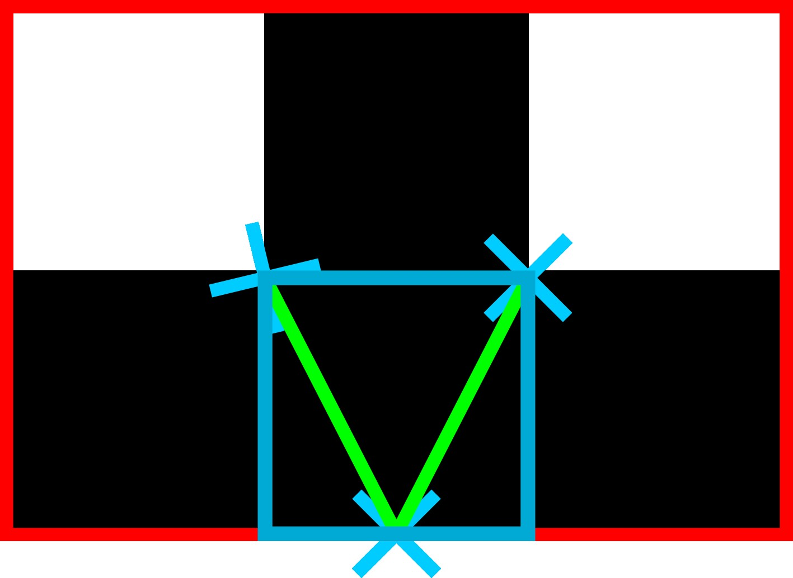
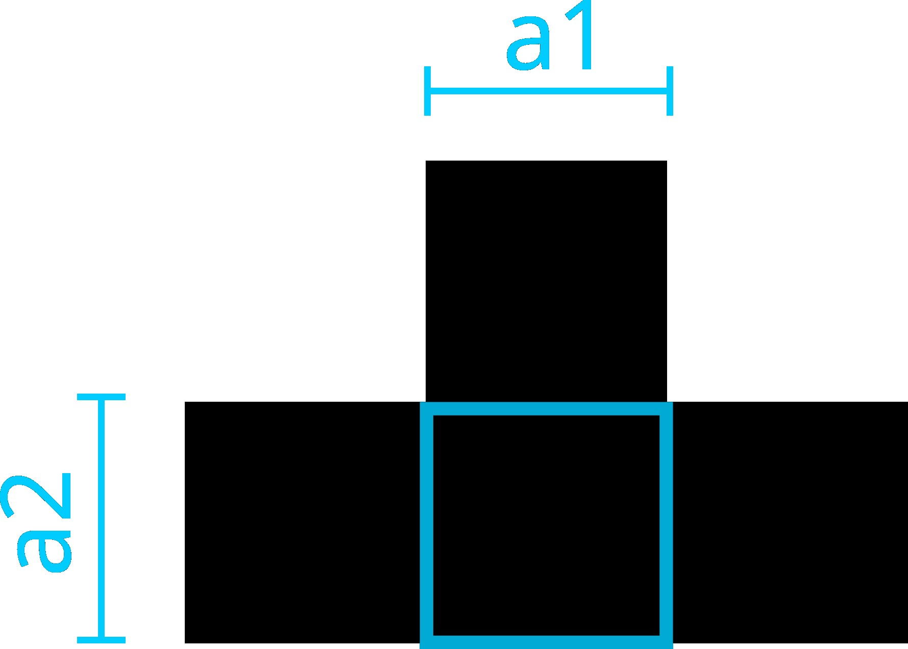

*Inscribe the largest circle, find its tangent points, and circumscribe a
rectangle along the footprint's own axes -- the main element.* Setback
pieces come from ``convex_hull(footprint) − footprint``, each measured
against its own circumscribed rectangle:

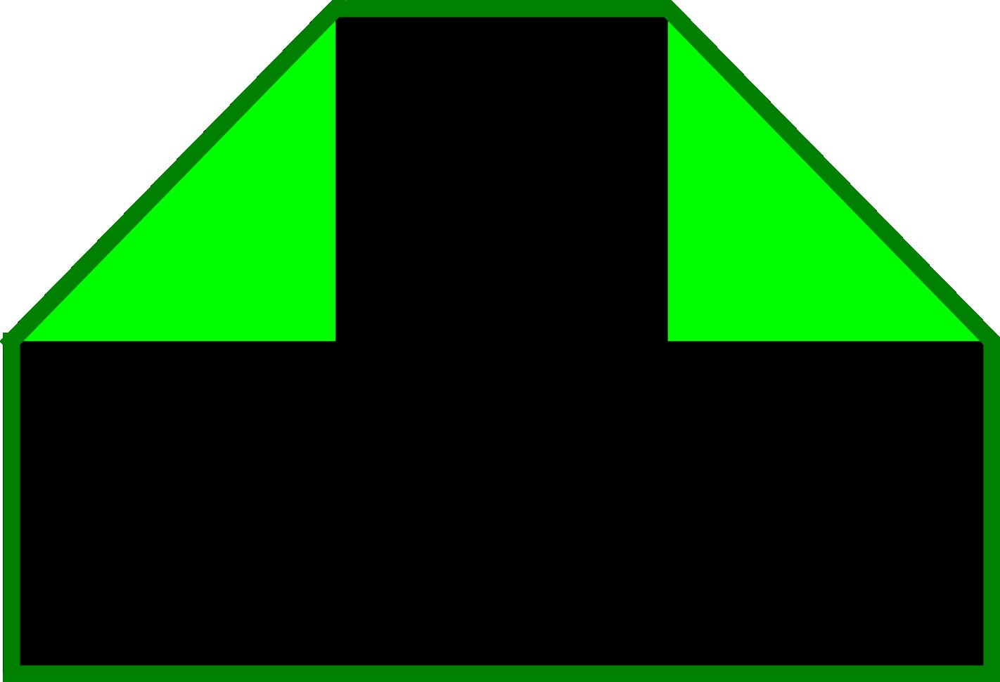
.. image:: figures/setback_step_2.jpg
   :width: 45%

The full construction on four prototype plans (L, T, Q, LT):

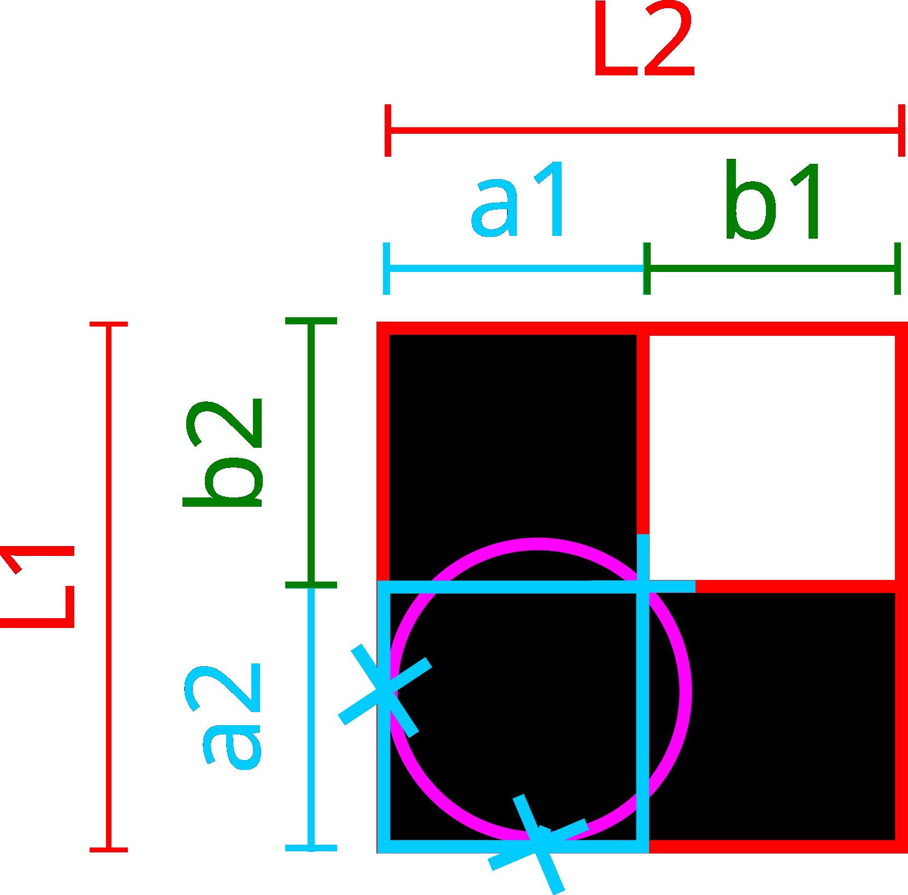
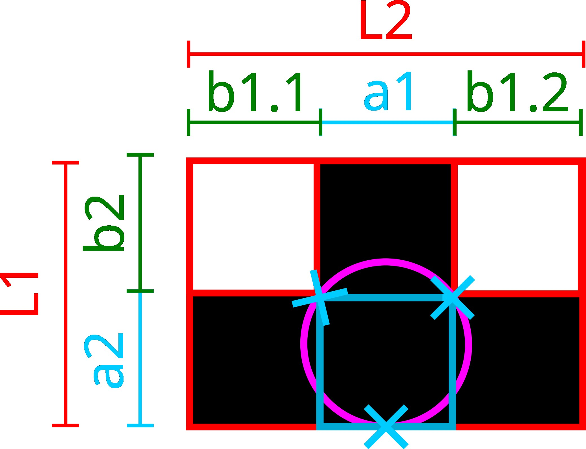
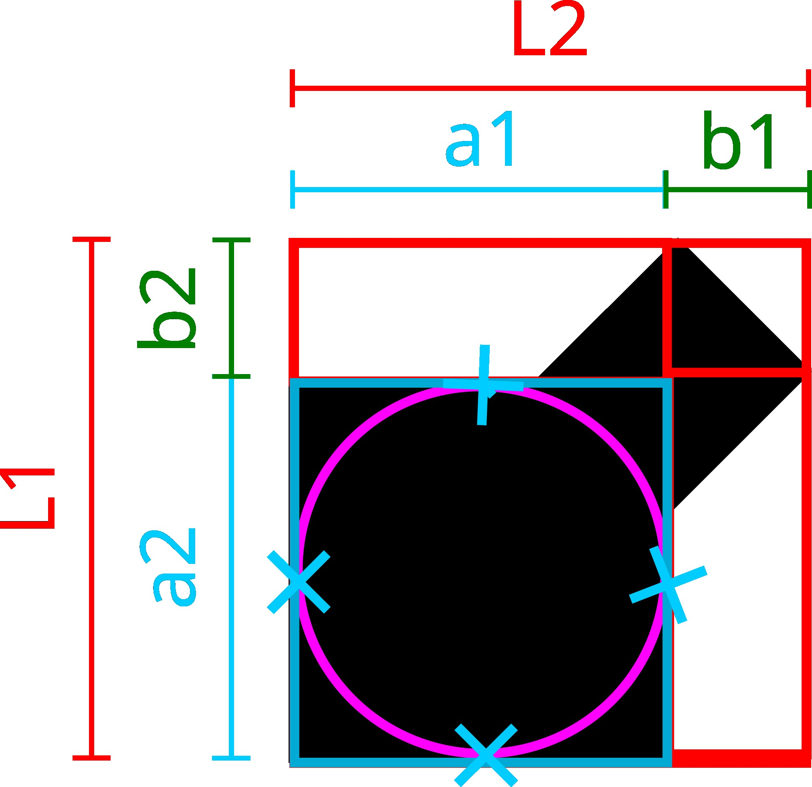
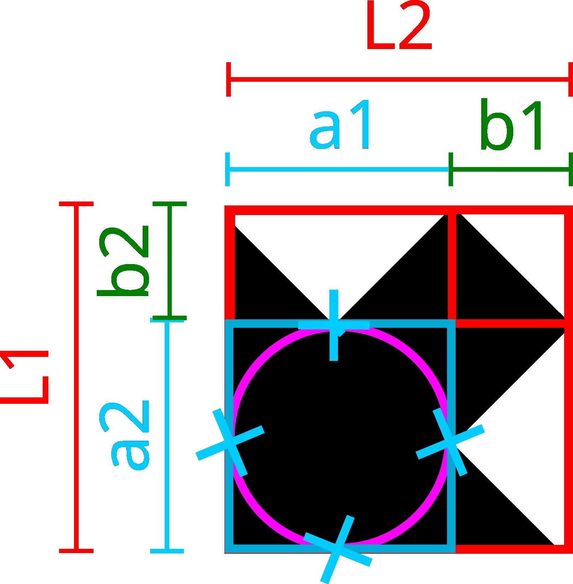

**Checked on shapes with a known answer.** The package's own computation
on the hand-built test shapes -- the asymmetric L is built so its setback
ratio is exactly 0.40 -- drawn under both axis conventions:

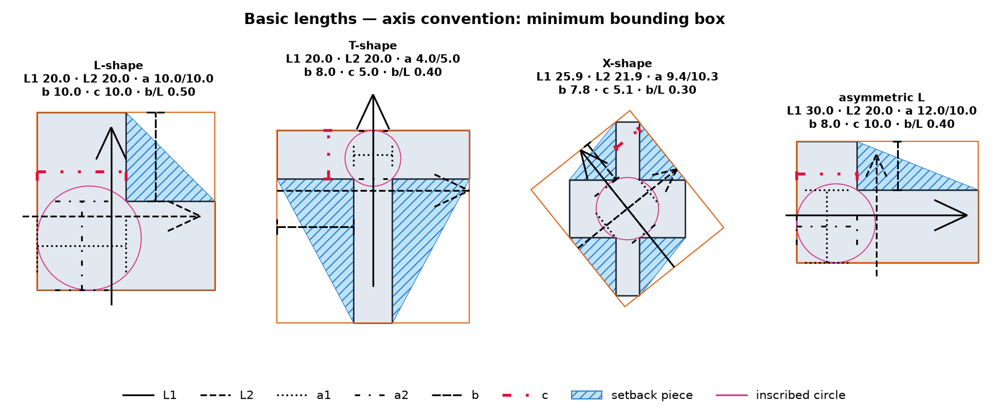

   Every basic length drawn on the test shapes (bounding-box axes), with
   the setback pieces (hatched) and the inscribed circle.

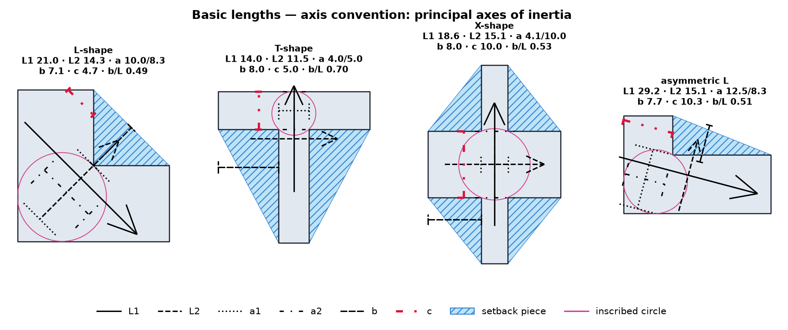

   The same, measured along the principal axes of inertia.

**On real data.** :math:`L_1, L_2, a_1, a_2, b, c` drawn on every building
under the bounding-box convention; it switches to the inertia convention
every few seconds and moves to the next pilot region every 10:

.. raw:: html

   <iframe src="_static/interactive/building_sizes/index.html" width="100%" height="640" style="border:1px solid #cbd5e0;border-radius:6px;" loading="lazy"></iframe>

4 · Footprint shape indices
------------------------------

*Module:* :mod:`footprint_attributes.shape` *· notebook:*
:doc:`examples/shape`

Plan-irregularity parameters from five international seismic codes -- EC8,
ASCE 7, GNDT-II, CSCR 2010 and NTC-23 -- plus three code-independent
compactness indices. Code parameters are computed under a *hollow-box*
idealisation: uniform walls and one slab. The offset between the centre of
mass and the centre of stiffness is the eccentricity that makes a building
twist:

.. image:: figures/box_idealization_and_eccentricity.jpg
   :width: 55%
   :align: center

**On real data.** The same 3-D tour as :doc:`index`'s interactive map:
the shape index first, then each of the 15 code metrics in turn, touring
all three pilot regions -- tick the overlays to draw the convex hull,
bounding box, inertia axis, basic lengths or contact-force arrows:

.. raw:: html

   <iframe src="_static/interactive/shape/index.html" width="100%" height="640" style="border:1px solid #cbd5e0;border-radius:6px;" loading="lazy"></iframe>
