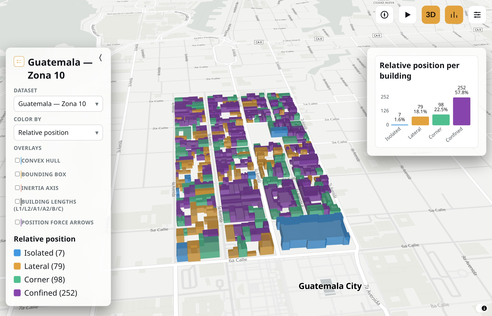
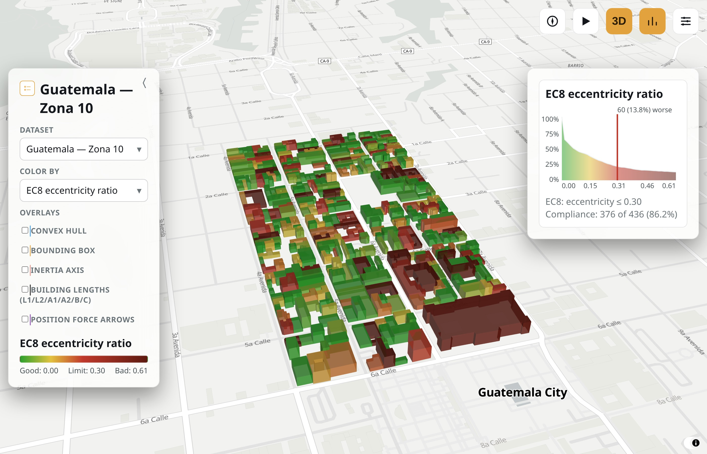
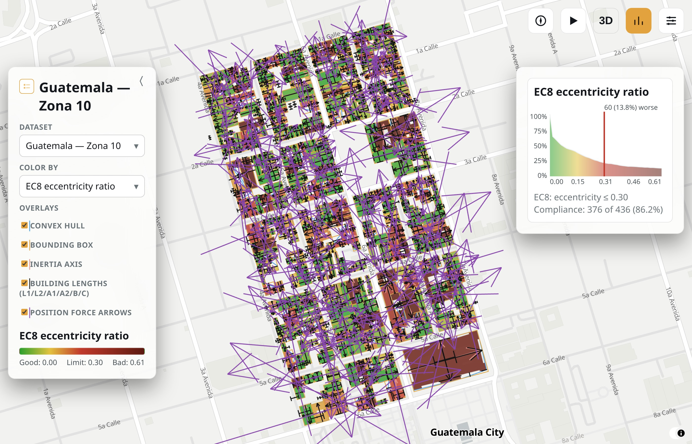

Examples
========

Each notebook loads the real sample dataset under ``examples/data/`` and
ends with a GeoDataFrame plus a suggested list of columns to plot on a map.

Interactive map
----------------

Runs entirely client-side (MapLibre + deck.gl, no backend) and computes
nothing itself -- everything it shows is precomputed from the pilot-region
footprints by :func:`footprint_attributes.visualization.build_map` (see
``docs/generate_map_data.py``), using this package's own
:func:`~footprint_attributes.shape.shape` and
:func:`~footprint_attributes.position.position`. Requires the ``vis``
extra: ``pip install "footprint-attributes[vis]"``.

Switch dataset with the top-left dropdown (Guatemala Zona 10, San José Mata
Redonda, Santo Domingo Ensanche Quisquella); color by relative position,
the 4-category shape index, or any of the 15 EC8/ASCE7/GNDT-II/CSCR2010/
NTC-23 shape-irregularity metrics described in :doc:`formulas`; click a
building for its full value breakdown. The "Overlays" checkboxes draw
per-building geometry on top of the map: convex hull, minimum bounding box,
inertia axis, the L1/L2/a1/a2/b/c basic-length dimensions, and the net
contact-force resultant arrow. The auto-playing tour (▶ button, top right)
cycles relative position, then the shape index, then each shape metric in
turn, one every 10s.

.. raw:: html

   <iframe src="_static/maps/index.html" width="100%" height="640" style="border:1px solid #444;" loading="lazy"></iframe>

.. image:: ../figures/interactive_map_shape_index.jpg
   :width: 49%
   :alt: Interactive map colored by shape index

Build it yourself against this repo's own pilot-region datasets with
``examples/generate_interactive_map.py``, or against your own footprints
with :func:`footprint_attributes.visualization.build_map` directly.

.. toctree::
   :maxdepth: 1

   examples/direction.ipynb
   examples/position.ipynb
   examples/shape.ipynb
   examples/building_sizes.ipynb
   examples/run.ipynb
