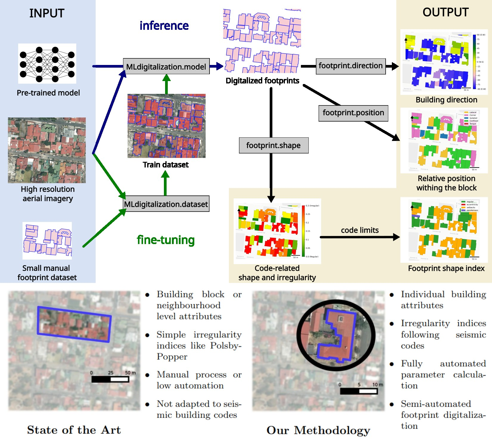

footprint_attributes
=====================

Automated computation of seismic behaviour modifiers from 2-D building
footprint polygons. Companion package to:

    Ureña-Pliego, M., Rodríguez-Saiz, J., Núñez-Álvarez, G.,
    Marchamalo-Sacristán, M., González-Rodrigo, B. (2026). *A methodology
    for the automated estimation of footprint-derived seismic behaviour
    modifiers in building exposure assessment.* Advanced Modeling and
    Simulation in Engineering Sciences, 13:3.
    `doi.org/10.1186/s40323-026-00323-y
    <https://link.springer.com/content/pdf/10.1186/s40323-026-00323-y.pdf>`_

Developed by the `Advanced Geomatics group (AGA)
<https://blogs.upm.es/aga/en/>`_ at the Universidad Politécnica de Madrid.
See :doc:`citation` for the full author list, ORCIDs, and funding.

.. toctree::
   :maxdepth: 2
   :caption: Contents

   installation
   api/index
   examples
   citation

Indices
-------

* :ref:`genindex`
* :ref:`modindex`
