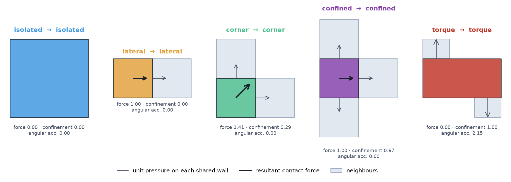
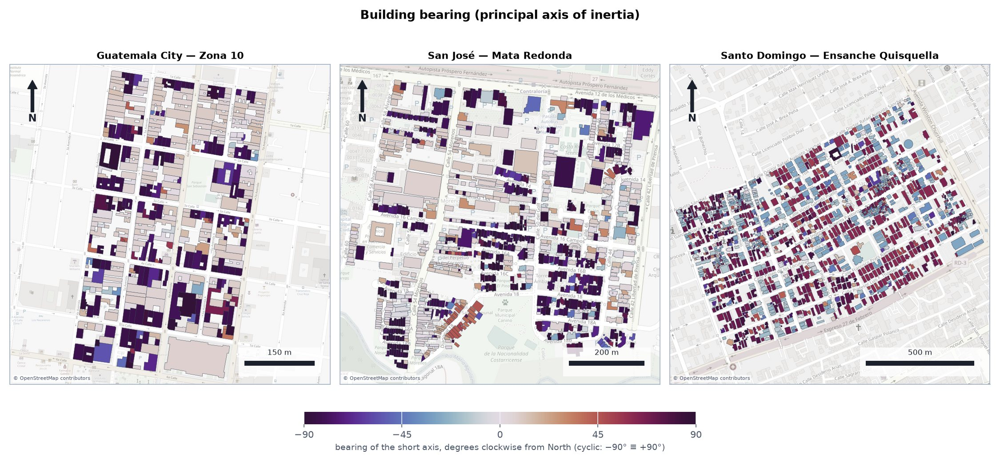
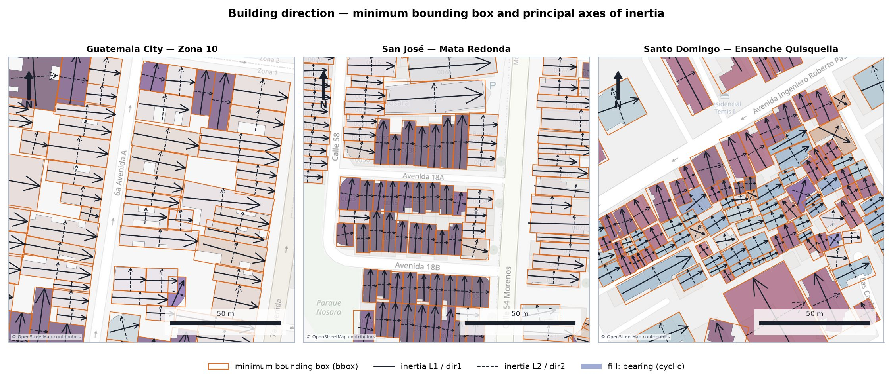
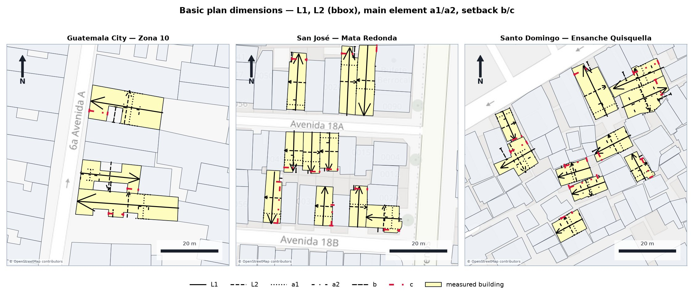
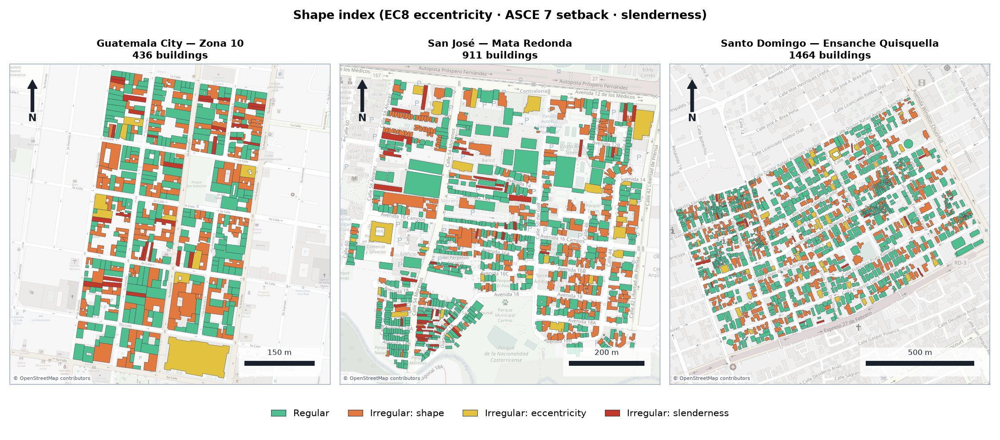
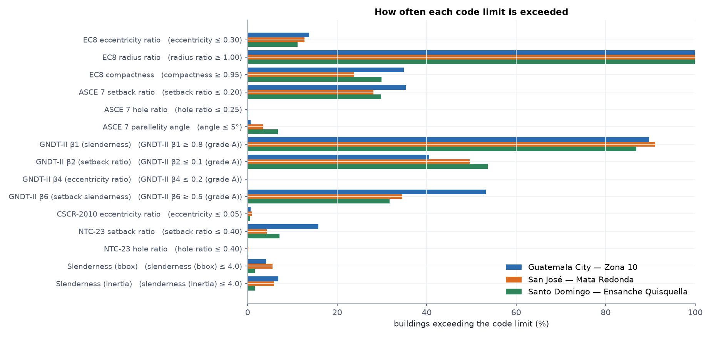
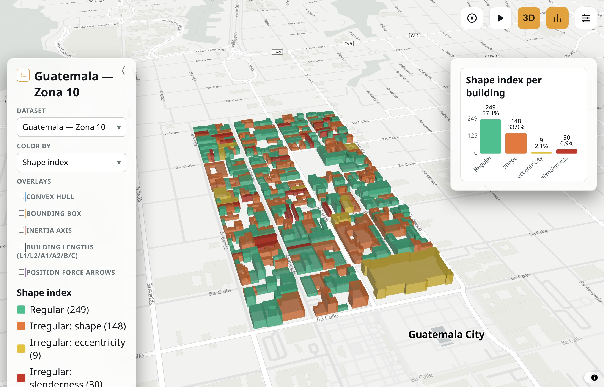

footprint_attributes
=====================

**Seismic behaviour modifiers from 2-D building footprints -- automated,
objective and reproducible.**

``footprint_attributes`` turns a file of building footprint polygons into
the attributes seismic risk models need for every building. These are its
direction, its position within the urban block, and its plan-shape
irregularity under five international seismic codes. Each is computed with
a deterministic geometric algorithm instead of expert judgement. It is the
companion package to:

    Ureña-Pliego, M., Rodríguez-Saiz, J., Núñez-Álvarez, G.,
    Marchamalo-Sacristán, M., González-Rodrigo, B. (2026). *A methodology
    for the automated estimation of footprint-derived seismic behaviour
    modifiers in building exposure assessment.* Advanced Modeling and
    Simulation in Engineering Sciences, 13:3.
    `doi.org/10.1186/s40323-026-00323-y
    <https://link.springer.com/content/pdf/10.1186/s40323-026-00323-y.pdf>`_

Developed by the `Advanced Geomatics group (AGA)
<https://blogs.upm.es/aga/en/>`_ at the Universidad Politécnica de Madrid
(see :doc:`citation`). Source code:
`github.com/GeomaticsCaminosUPM/footprint_attributes
<https://github.com/GeomaticsCaminosUPM/footprint_attributes>`_.

.. image:: figures/graphical_abstract.jpg
   :width: 85%
   :align: center
   :alt: Graphical abstract

Why?
----

Seismic risk models adjust each structural typology's vulnerability with
*behaviour modifiers*. Several of them -- the ones boxed in red in the GEM
building taxonomy below -- can be derived from the footprint alone, but are
usually assigned by hand by surveyors reading code provisions. This package
turns those provisions into geometric algorithms, so the same footprint
always gets the same answer and a national inventory takes minutes instead
of field campaigns.

.. image:: figures/DNA.jpg
   :width: 65%
   :align: center
   :alt: GEM taxonomy attributes; red boxes mark those automated here

What it computes
----------------

Every value on this page is computed by this package from nothing but the
raw footprint geometry of three pilot regions: Guatemala City (Zona 10),
San José (Mata Redonda) and Santo Domingo (Ensanche Quisquella).

**1 · Block position within the block** --
:mod:`~footprint_attributes.position`. A contact-force analogy classifies
each building as isolated, lateral, corner, confined or torque:

.. figure:: maps/block_position.jpg
   :width: 100%
   :alt: Block position of every building in the three pilot regions

   One hand-built scenario per class, with the contact force on each shared
   wall and its resultant.

**2 · Building direction** -- :mod:`~footprint_attributes.direction`.
Each footprint's principal axes come from its minimum bounding box or its
second moment of area, and its bearing is the heading of the short axis:

**3 · Basic plan dimensions** -- the :math:`L_1, L_2, a_1, a_2, b, c`
lengths that the setback and slenderness parameters are built from:

**4 · Footprint shape indices** -- :mod:`~footprint_attributes.shape`.
The package computes 15 plan-irregularity parameters from EC8, ASCE 7,
GNDT-II, CSCR 2010 and NTC-23, plus three code-independent compactness
indices. Three of the code checks are condensed into a single shape index:

   How often each code limit is exceeded in each pilot region.

See :doc:`concepts` for the full visual walkthrough of each attribute and
:doc:`formulas` for the exact formula, source code and pilot-region map
behind every column.

Quick start
-----------

.. code-block:: bash

   pip install "footprint-attributes @ git+https://github.com/GeomaticsCaminosUPM/footprint_attributes.git@v1.0.0"

.. code-block:: python

   import geopandas as gpd
   import footprint_attributes

   footprints = gpd.read_file("footprints.gpkg")
   result = footprint_attributes.run(
       footprints,
       config={"columns": ["position", "bearing", "EC8", "ASCE7_setbackRatio"]},
   )

See :doc:`installation` and :doc:`api/index` for more.

Interactive map
---------------

The same attributes for every building in one client-side 3D map. It opens
in an auto-playing tour -- block position, the shape index, then each of
the 15 shape metrics -- with the camera orbiting. Drag, zoom or click to
take over; tick the overlays to draw the convex hull, bounding box, inertia
axis, basic lengths or contact-force arrows on the buildings (see
:doc:`examples` for details):

.. raw:: html

   <iframe src="_static/maps/index.html" width="100%" height="640" style="border:1px solid #cbd5e0;border-radius:6px;" loading="lazy"></iframe>

.. image:: figures/interactive_map_ec8_eccentricity.jpg
   :width: 32%
.. image:: figures/interactive_map_overlays.jpg
   :width: 32%

*Left to right: the shape index, a norm-based metric with its exceedance
chart, and all five geometry overlays enabled.*

.. toctree::
   :maxdepth: 2
   :caption: Contents

   installation
   concepts
   api/index
   formulas
   examples
   citation
   license

Indices
-------

* :ref:`genindex`
* :ref:`modindex`
